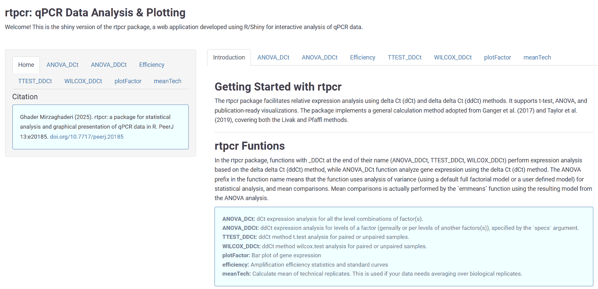
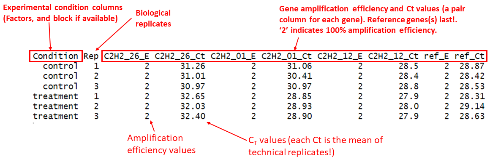
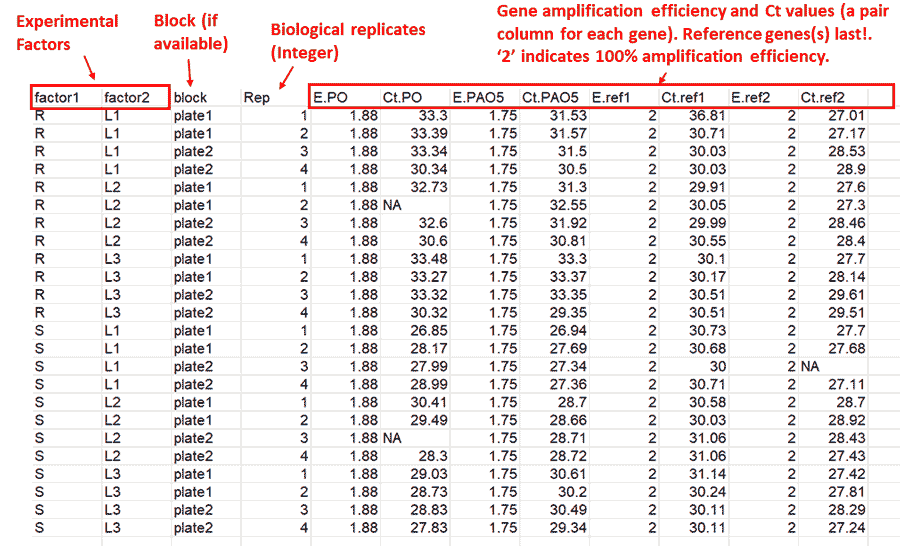
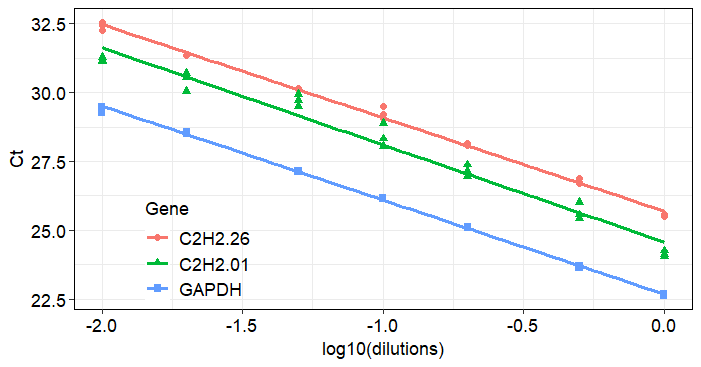
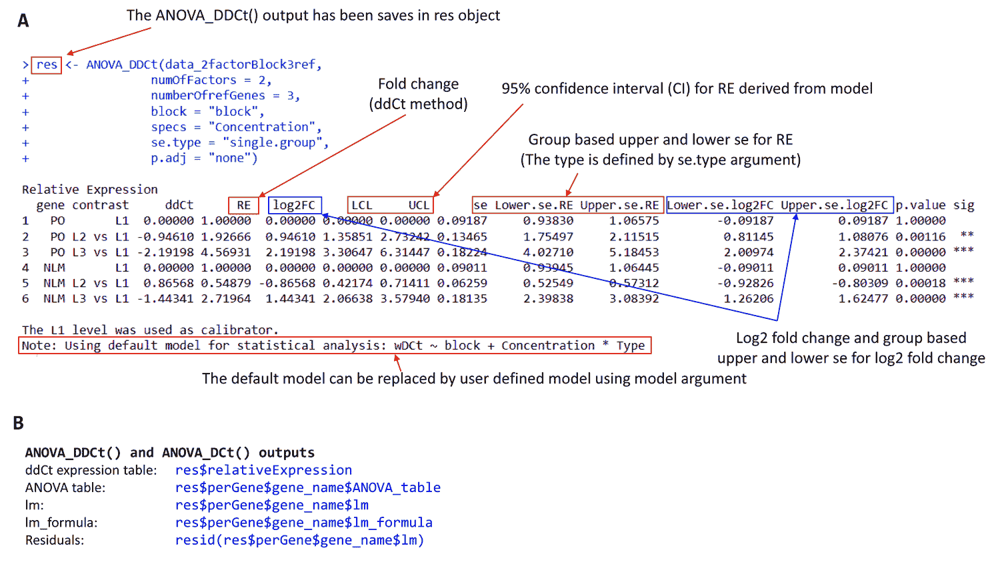
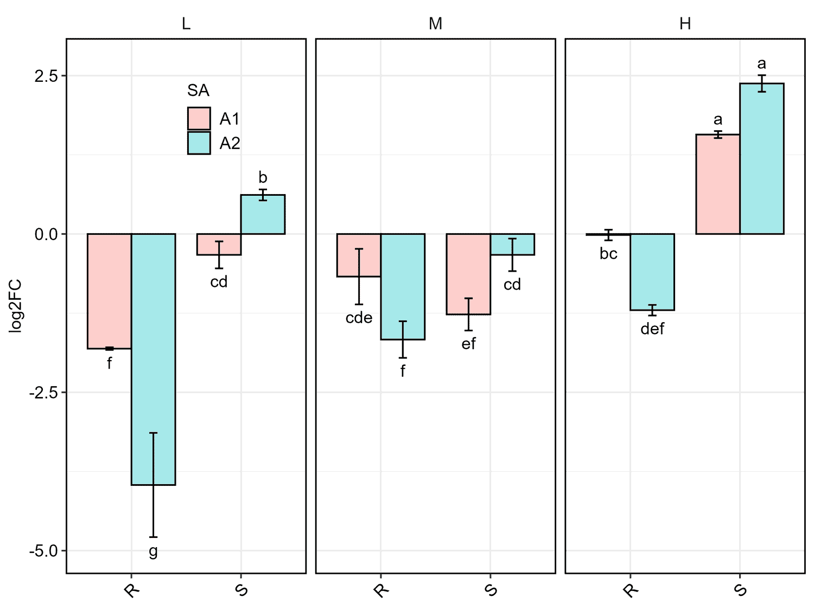
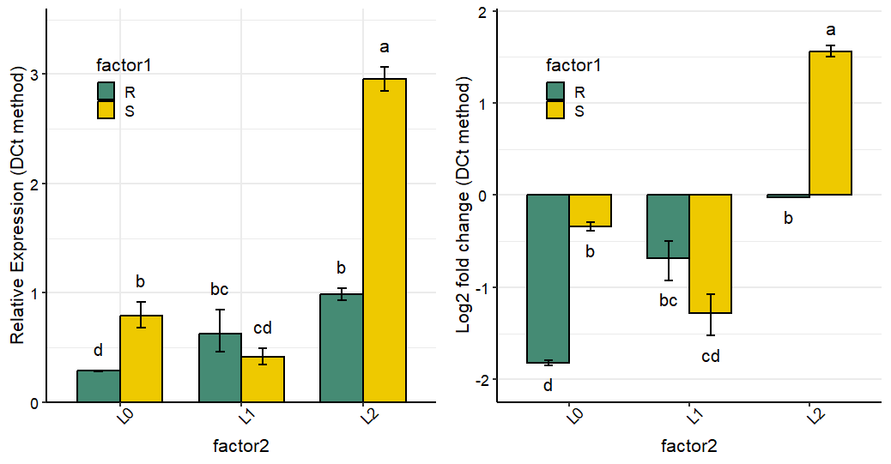
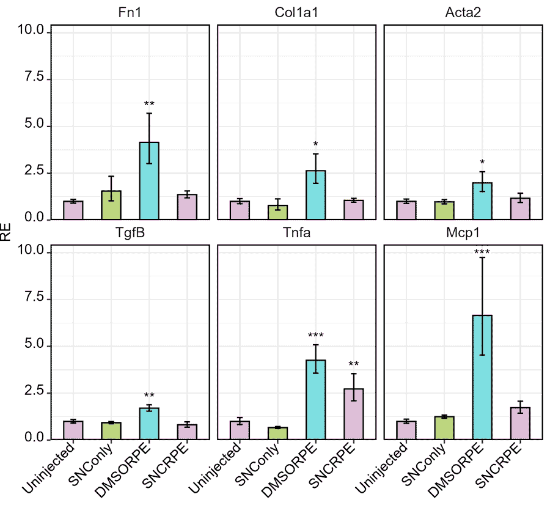
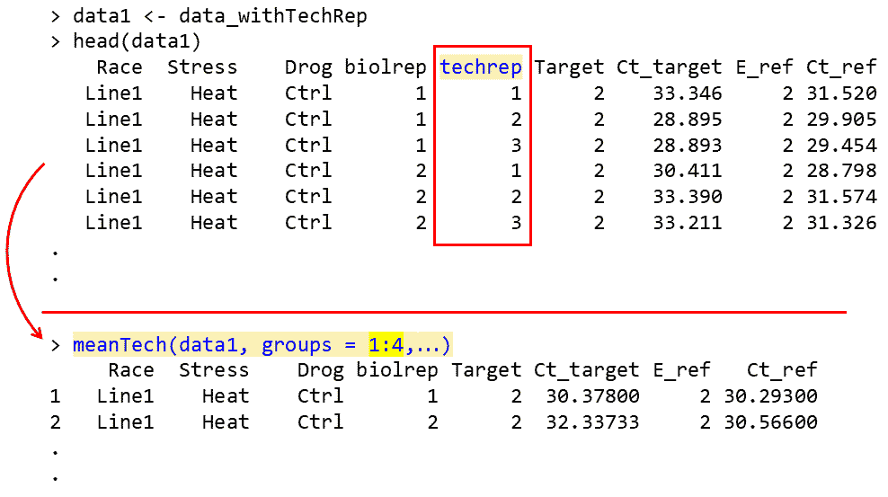

<!-- README.md is generated from README.Rmd. Please edit that file -->

# rtpcr 

<!-- badges: start -->

[](https://cran.rstudio.com/web/packages/rtpcr/index.html)
[](https://github.com/mirzaghaderi/rtpcr)
[](https://CRAN.R-project.org/package=rtpcr)

⁠<!-- badges: end -->

rtpcr is a tool for analysis of RT-qPCR gene expression data using
$\Delta Ct$ and $\Delta\Delta Ct$ methods, including t-tests and ANOVA,
repeated-measures models, and publication-ready visualizations. The
package implements a general calculation method adopted from Ganger et
al. (2017) and Taylor et al. (2019), covering both the Livak and Pfaffl
methods.

 *rtpcr is now available as shiny_rtpcr, a web
application developed using R/Shiny for interactive analysis of qPCR
data at <https://mirzaghaderi.shinyapps.io/rtpcr/>*

# Functions

The rtpcr package gets efficiency (E) the Ct values of genes and
performs different analyses using the following functions.

| Function | Description |
|----|----|
| `ANOVA_DCt` | $\Delta Ct$ ANOVA analysis |
| `ANOVA_DDCt` | $\Delta\Delta Ct$ ANOVA analysis |
| `TTEST_DDCt` | $\Delta\Delta Ct$ method *t*-test analysis |
| `WILCOX_DDCt` | $\Delta\Delta Ct$ method wilcox.test analysis |
| `plotFactor` | Bar plot of gene expression for one-, two- or three-factor experiments |
| `Means_DDCt` | Pairwise comparison of RE values for any user-specified effect |
| `efficiency` | Amplification efficiency statistics and standard curves |
| `meanTech` | Calculate mean of technical replicates |
| `multiplot` | Combine multiple ggplot objects into a single layout |
| `compute_wDCt` | Cleaning data and weighted delta Ct (wDCt) calculation |
| `long_to_wide` | Converts a 4-column qPCR long data format to wide format |

# Quick start

### Installing and loading

The `rtpcr` package can be installed by running the following code in R:

from CRAN:

``` r
# Installing from CRAN
install.packages("rtpcr")

# Loading the package
library(rtpcr)
```

Or from from GitHub (developing version):

``` r
devtools::install_github("mirzaghaderi/rtpcr", build_vignettes = TRUE)
```

# Input data structure

For relative expression analysis (using `TTEST_DDCt`, `WILCOX_DDCt`,
`ANOVA_DCt`, and `ANOVA_DDCt` functions), the amplification efficiency
(`E`) and `Ct` or `Cq` values (the mean of technical replicates) is used
for the input table. If the `E` values are not available you should use
‘2’ instead representing the complete primer amplification efficiency.
The input data table should include the following columns from left to
wright:

1.  Experimental condition columns (and one block if available [NOTE
    1](#note-1))
2.  Replicates information (biological replicates or subjects; see [NOTE
    2](#note-2), and [NOTE 3](#note-3))  
3.  Target genes efficiency and Ct values (a pair column for each gene).
4.  Reference genes efficiency and Ct values (a pair column for each
    gene) [NOTE 4](#note-4).

The package supports **one or more target or reference gene(s)**,
supplied as efficiency–Ct column pairs. Reference gene columns must
always appear last. Two sample input data sets are presented below.

<figure>

<figcaption aria-hidden="true">Figure 1: A sample input data with one
experimetal factor, replicate column and E/Ct information of target and
reference genes</figcaption>
</figure>

<br>

If there is no blocking factor, the block column should be omitted.
However, a column for biological replicates (which may be named “Rep”,
“id” or similar) is always required.

<br>

<figure>

<figcaption aria-hidden="true">Figure 2: A sample input data with two
experimetal factors, blocking factor, replicate column and E/Ct
information of target and reference genes</figcaption>
</figure>

#### NOTE 1

When a qPCR experiment is done in multiple qPCR plates, variation
resulting from the plates may interfere with the actual amount of gene
expression. One solution is to conduct each plate as a randomized block
so that at least one replicate of each treatment and control is present
on a plate. Block effect is usually considered as random and its
interaction with any main effect is not considered.

#### NOTE 2

For `TTEST_DDCt` and `WILCOX_DDCt` (independent groups), `ANOVA_DCt`,
and `ANOVA_DDCt` each row is from a separate and unique biological
replicate. For example, a data frame with 12 rows has come from an
experiment with 12 individuals. The repeated measure models are intended
for experiments with repeated observations (e.g. time-course data). In
repeated measure experiments the Replicate column contains identifiers
for each individual (id or subject). For example, all rows with a `1` at
Rep column correspond to a single individual, all rows with a `2`
correspond to another individual, and so on, which have been sampled at
specific time points.

#### NOTE 3

Your data table may also include a column of technical replicates (For
example, using one target and one reference genes, if you want to have 4
biological and 3 technical replicates under Control and Treatment
conditions, there would be a table of 24 rows containing both biological
replicates and technical replicate columns in the data). In this case,
the `meanTech` function should be applied first to calculate the mean of
the technical replicates. The resulting collapsed table is then used as
the input for expression analysis. To use the `meanTech` function
correctly, the technical replicate column must appear immediately after
the biological replicate column (see [Mean of technical
replicates](#mean-of-technical-replicates) for an example).

<figure>

<figcaption aria-hidden="true">Figure 3: This schematic illustrates an
experimental design with four biological replicates for both Control and
Treatment conditions, assuming a single sampling time point, where cDNA
samples were analyzed by qPCR. The diagram details the initial dataset
containing technical replicates (three technical replicates shown for
Biological Replicate 1 under Control, with example amplification
efficiencies (E) and cycle threshold (Ct) values for both target and
reference genes) and summarizes the data processing step where technical
replicates are averaged using the command meanTech(df, groups = 1:2).
The resulting condensed dataset, comprising eight rows (one per
biological replicate for each condition), is the final data structure
used for the downstream relative expression analysis, with example
averaged Ct values for target and reference genes displayed for all four
Control and four Treatment biological replicates.</figcaption>
</figure>

#### NOTE 4

Complete amplification efficiency (E) in the rtpcr package is denoted by
2. This means that 2 indicates 100%, and 1.85 and 1.70 indicate 0.85%
and 0.70% amplification efficiencies.

# Handling missing data

Missing Ct values for target genes is Handled using the
`set_missing_target_Ct_to_40` function. If `TRUE`, missing target gene
Ct values become 40; if `FALSE` (default), they become NA. missing Ct
values of reference genes are always converted to NA. If there are more
than one reference gene, NA in the place of the E or the Ct value of
cause skipping that gene and remaining references are geometrically
averaged in that replicate.

# Data Analysis

### Amplification Efficiency

The `efficiency` function calculates the amplification efficiency (E),
slope, and R² statistics for genes, and performs pairwise comparisons of
slopes. It takes a data frame in which the first column contains the
dilution ratios, followed by the Ct value columns for each gene.

``` r
# Applying the efficiency function
data <- read.csv(system.file("extdata", "data_efficiency.csv", package = "rtpcr"))
data
# dilutions Gene1   Gene2   Gene3
# 1.00  25.58   24.25   22.61
# 1.00  25.54   24.13   22.68
# 1.00  25.50   24.04   22.63
# 0.50  26.71   25.56   23.67
# 0.50  26.73   25.43   23.65
# 0.50  26.87   26.01   23.70
# 0.20  28.17   27.37   25.11
# 0.20  28.07   26.94   25.12
# 0.20  28.11   27.14   25.11
# 0.10  29.20   28.05   26.17
# 0.10  29.49   28.89   26.15
# 0.10  29.07   28.32   26.15
# 0.05  30.17   29.50   27.12
# 0.05  30.14   29.93   27.14
# 0.05  30.12   29.71   27.16
# 0.02  31.35   30.69   28.52
# 0.02  31.35   30.54   28.57
# 0.02  31.35   30.04   28.53
# 0.01  32.55   31.12   29.49
# 0.01  32.45   31.29   29.48
# 0.01  32.28   31.15   29.26

# Analysis
efficiency(data)

# $Efficiency
#    Gene     Slope        R2        E
# 1 Gene1 -3.388094 0.9965504 1.973110
# 2 Gene2 -3.528125 0.9713914 1.920599
# 3 Gene3 -3.414551 0.9990278 1.962747
# 
# $Slope_compare
# $contrasts
#  contrast          estimate    SE df t.ratio p.value
#  C2H2.26 - C2H2.01   0.1400 0.121 57   1.157  0.4837
#  C2H2.26 - GAPDH     0.0265 0.121 57   0.219  0.9740
#  C2H2.01 - GAPDH    -0.1136 0.121 57  -0.938  0.6186
```

<figure>

<figcaption aria-hidden="true">Figure 4: Standard curve plot displaying
the relationship between the logarithm of cDNA dilution factors (ranging
from -2.0 to 0.0) and their corresponding qPCR cycle threshold (Ct)
values for three genes: C2H2.26, C2H2.01, and GAPDH. The accompanying
table provides the precise Ct measurements, which is used to determine
the amplification efficiency for each gene</figcaption>
</figure>

### Relative expression

**Single factor experiment with two levels (e.g. Control and
Treatment):** `TTEST_DDCt()` function is used for relative expression
analysis in treatment condition compared to control condition. Both
paired and unpaired experimental designs are supported. if the data
doesn’t follow t.test assumptions, the `WILCOX_DDCt()` function can be
used instead.

**Single factor experiment with more than two levels, or multi-factor
experiments:** In these cases, `ANOVA_DDCt()` and `ANOVA_DCt()`
functions are used for the analysis of qPCR data. By default,
statistical analysis is performed based on uni- or multi-factorial
Completely Randomized Design (CRD) or Randomized Complete Block Design
(RCBD) design based on `numOfFactors` and the availability of `block`.
However, optional custom model formula as a character string can be
supplied to these functions. If provided, this overrides the default
formula (uni- or multi-factorial CRD or RCBD design). The formula uses
`wDCt` as the response variable (wDCt is automatically created by the
function). For mixed models, include random effects using `lmer` syntax
(e.g., `wDCt ~ Treatment + (1 | id)`). Below are a sample of most common
models that can be used.

| Example models may be used in `ANOVA_DCt()` or `ANOVA_DDCt()` functions | Experimental design |
|----|----|
| wDCt ~ Condition | Completely Randomized Design (CRD). Can also be used for t.test with two independent groups. (**default**) |
| wDCt ~ Factor1 \* Factor2 \* Factor3 | Factorial under Completely Randomized Design (RCBD) (**default**) |
| wDCt ~ block + Factor1 \* Factor2 | Factorial under Randomized Complete Block Design (**default**) |
| wDCt ~ time + (1 \| id) | Repeated measure analysis: different time points. Also can be used for t.test with two paired groups. |
| wDCt ~ Condition \* time + (1 \| id) | Repeated measure analysis: split-plot in time |
| wDCt ~ wDCt ~ Condition \* time + (1 \| block) + (1 \| id) | Repeated measure analysis: split-plot in time |
| wDCt ~ Type + Concentration | Analysis of Covariance: Type is covariate |
| wDCt ~ block + Type + Concentration | Analysis of Covariance with blocking factor: block and Type are covariates |

#### NOTE

For CRD, RCBD, and factorial experiments arranged in either CRD or RCBD
designs, you do not need to explicitly define a model. The package
automatically selects an appropriate model based on the provided
arguments. If no model is specified, the default model used is printed
along with the output expression table.

#### NOTE

Sometime groups are paired (Repeated measure experiments). Examples: 1)
Analyzing gene expression in different time points, or before and after
treatment in each biological replicate; 2) Analyzing gene expression
between two tissue types within the same organism. For such analysis
types, if there are only two time points, we can use the `TTEST_DDCt`
with the argument `paired = TRUE`; or `ANOVA_DDCt` (if there are two or
more time points) with a repeated measure model such as
`wDCt ~ Treatment + ( 1 | id)` or `wDCt ~ Treatment + ( 1 | Rep)`.

<figure>

<figcaption aria-hidden="true">Figure 5: A) Basic structure of
independent group- or paired group-experiments. Examples of paired
groups ( or repeated measure experiments): 1) Analysing gene expression
before and after treatment in the sampe biological replicates; 2)
Analysing gene expression between two tissue types within the same
organism. For such analysis types we can use the TTEST_DDCt with the
argument paired = TRUE; or ANOVA_DDCt with a repeated measure model such
as wDCt ~ Treatment + ( 1 | id) or wDCt ~ Treatment + ( 1 | Rep). B)
Calculation of standard error (se) and confidense interval (CI) for
ddCt–based relative expression in the <code>ANOVA_DDCt()</code> function
of the rtpcr package. Standard errors and confidense interval are
calculated from model-based residuals by default
(<code>modelBased_se = TRUE</code>) according to the selected
<code>se.type</code> (One of <code>"paired.group"</code>,
<code>"two.group"</code>, or <code>"single.group"</code>). By setting
<code>modelBased_se = FALSE</code> standard errors are calculated
directly from the observed wDCt values within each group, although for
the single factor experiments the two cases are the same. Method 4 is
based on the pooled error from which the confidence interval is
calculated and can be used in any conditions as it is derived from a
fitted model. se: group standard error, SE: pooled standard error. The
figure illustrates how weighted dCt (wdCt) and weighted ddCt (wddCt)
values are used under different experimental designs, and how the
standard error is computed when <code>modelBased_se = FALSE</code>,
depending on the <code>se.type</code> argument.
<code>"paired.group"</code> computes se from paired differences (used
when a random id effect is present), <code>"two.group"</code> uses the
unpaired two-group t-test standard error against the reference level,
and <code>"single.group"</code> computes se within each level using a
one-group t-test. For independent groups, <code>ANOVA_DDCt()</code>
automatically uses <code>se.type = "two.group"</code>, and if
repeated‐measure or paired designs model is specified,
<code>ANOVA_DDCt()</code> automatically selects
<code>se.type = "paired.group"</code></figcaption>
</figure>

<br>

### Examples

Relative expression analysis can be done using $\Delta\Delta Ct$ or
$\Delta Ct$ methods through different functions (i.e. `TTEST_DDCt`,
`WILCOX_DDCt`, `ANOVA_DDCt()`, and `ANOVA_DCt()`). Below are some
examples of expression analysis using $\Delta\Delta Ct$ method.

``` r
data <- read.csv(system.file("extdata", "data_Yuan2006PMCBioinf.csv", package = "rtpcr"))
data

# Anova analysis
ANOVA_DDCt(
  data,
  specs = "condition",
  numOfFactors = 1,
  numberOfrefGenes = 1,
  block = NULL)

# An example of a properly arranged dataset from a repeated-measures experiment.
data <- read.csv(system.file("extdata", "data_repeated_measure_1.csv", package = "rtpcr"))
data

# time  id  E_Target    Ct_target   E_Ref      Ct_Ref
#    1   1      2       18.92   2   32.77
#    1   2      2       15.82   2   32.45
#    1   3      2       19.84   2   31.62
#    2   1      2       19.46   2   33.03
#    2   2      2       17.56   2   33.24
#    2   3      2       19.74   2   32.08
#    3   1      2       15.73   2   32.95
#    3   2      2       17.21   2   33.64
#    3   3      2       18.09   2   33.40

# Repeated measure analysis
res <- ANOVA_DDCt(
  data,
  numOfFactors = 1,
  numberOfrefGenes = 1,
  specs = "time",
  block = NULL, model = wDCt ~ time + (1 | id))


# Paired t.test (equivalent to repeated measure analysis, but not always the same results, due to different calculation methods!)
TTEST_DDCt(
  data[1:6,], 
  numberOfrefGenes = 1, 
  paired = T)


# Anova analysis
data3 <- read.csv(system.file("extdata", "data_2factorBlock3ref.csv", package = "rtpcr"))

res <- ANOVA_DDCt(
  x = data3,
  specs = "Type | Concentration",
  numOfFactors = 2,
  numberOfrefGenes = 3,
  block = "block",
  analyseAllTarget = TRUE)
```

# Output

## Data output

All the functions for relative expression analysis (including
`TTEST_DDCt`, `WILCOX_DDCt`, `ANOVA_DDCt()`, and `ANOVA_DCt()`) return
the relative expression table which include fold change and
corresponding statistics. The output of `ANOVA_DDCt()`, and
`ANOVA_DCt()` also include lm model, residuals, raw data and ANOVA table
for each gene. These outputs can be obtained as follow:

| Per_gene Output  | Code                                |
|------------------|-------------------------------------|
| expression table | `res$relativeExpression`            |
| ANOVA table      | `res$perGene$gene_name$ANOVA_table` |
| ANOVA lm         | `res$perGene$gene_name$lm`          |
| ANOVA lm formula | `res$perGene$gene_name$lm_formula`  |
| Residuals        | `resid(res$perGene$gene_name$lm)`   |

``` r
# Relative expression table for the specified column in the input data:
data3 <- read.csv(system.file("extdata", "data_2factorBlock3ref.csv", package = "rtpcr"))

res <- ANOVA_DDCt(
  x = data3,
  specs = "Concentration",
  numOfFactors = 2,
  numberOfrefGenes = 3,
  block = "block",
  analyseAllTarget = TRUE)

# Relative Expression
#   gene contrast     ddCt      RE   log2FC     LCL     UCL      se Lower.se.RE Upper.se.RE Lower.se.log2FC Upper.se.log2FC  pvalue sig
# 1   PO       L1  0.00000 1.00000  0.00000 0.00000 0.00000 0.13940     0.90790     1.10144         0.00000         0.00000 1.00000    
# 2   PO L2 vs L1 -0.94610 1.92666  0.94610 1.25860 2.94934 0.14499     1.74245     2.13036         0.85564         1.04613 0.00116  **
# 3   PO L3 vs L1 -2.19198 4.56931  2.19198 3.08069 6.77724 0.29402     3.72685     5.60221         1.78783         2.68748 0.00000 ***
# 4  NLM       L1  0.00000 1.00000  0.00000 0.00000 0.00000 0.91809     0.52921     1.88962         0.00000         0.00000 1.00000    
# 5  NLM L2 vs L1  0.86568 0.54879 -0.86568 0.39830 0.75614 0.36616     0.42577     0.70734        -1.11579        -0.67163 0.00018 ***
# 6  NLM L3 vs L1 -1.44341 2.71964  1.44341 1.94670 3.79946 0.17132     2.41511     3.06256         1.28179         1.62542 0.00000 ***
# 
# The L1 level was used as calibrator.
# Note: Using default model for statistical analysis: wDCt ~ block + Concentration * Type 


ANOVA_table <- res$perGene$PO$ANOVA_table
ANOVA_table

lm <- res$perGene$PO$lm
lm

lm_formula <- res$perGene$gene_name$lm_formula
lm_formula

residuals <- resid(res$perGene$gene_name$lm)
residuals
```

<figure>

<figcaption aria-hidden="true">Figure 6: All the functions for relative
expression analysis (including <code>TTEST_DDCt</code>,
<code>WILCOX_DDCt</code>, <code>ANOVA_DDCt()</code>, and
<code>ANOVA_DCt()</code>) return the relative expression table which
include fold change and corresponding statistics. The output of
<code>ANOVA_DDCt()</code>, and <code>ANOVA_DCt()</code> also include lm
model, residuals, raw data and ANOVA table for each gene.</figcaption>
</figure>

## Plot output

A single function of `plotFactor` is used to produce barplots for one-
to three-factor expression tables.

## Plot output: example 1

``` r
data <- read.csv(system.file("extdata", "data_3factor.csv", package = "rtpcr"))
#Perform analysis first
res <- ANOVA_DCt(
  data,
  numOfFactors = 3,
  numberOfrefGenes = 1,
  block = NULL)
  
df <- res$relativeExpression
df
 # Generate three-factor bar plot
plotFactor(
  df,
  x_col = "SA",       
  y_col = "log2FC",       
  group_col = "Type",   
  facet_col = "Conc",    
  Lower.se_col = "Lower.se.log2FC",
  Upper.se_col = "Upper.se.log2FC",
  letters_col = "sig",
  letters_d = 0.3,
  col_width = 0.7, 
  dodge_width = 0.7,
  fill_colors = c("palegreen3", "skyblue"),
  color = "black",
  base_size = 14, 
  alpha = 1,
  legend_position = c(0.1, 0.2))
```



# How to edit ouptput plots?

the rtpcr `plotFactor` function create ggplot objects for one to three
factor tables that can further be edited by adding new layers:

| Task | Example Code |
|----|----|
| Change y-axis label | `p + ylab("Relative expression ($\Delta\Delta Ct$ method)")` |
| Add a horizontal reference line | `p + geom_hline(yintercept = 0, linetype = "dashed")` |
| Change y-axis limits | `p + scale_y_continuous(expand = expansion(mult = c(0, 0.1)))` |
| Relabel x-axis | `p + scale_x_discrete(labels = c("A" = "Control", "B" = "Treatment"))` |
| Change fill colors | `p + scale_fill_brewer(palette = "Set2")` |

### Plot output: example 2

``` r
data <- read.csv(system.file("extdata", "data_2factorBlock.csv", package = "rtpcr"))
res <- ANOVA_DCt(data, 
      numOfFactors = 2,
      block = "block",
      numberOfrefGenes = 1)

df <- res$relativeExpression

plotFactor(
  data = df,
  x_col = "factor2",
  y_col = "RE",
  group_col = "factor1",
  Lower.se_col = "Lower.se.RE",
  Upper.se_col = "Upper.se.RE",
  letters_col = "sig",
  letters_d = 0.2,
  fill_colors = c("aquamarine4", "gold2"),
  color = "black",
  alpha = 1,
  col_width = 0.7,
  dodge_width = 0.7,
  base_size = 16, 
  legend_position = c(0.8, 0.8))
```



### Plot output: example 3

``` r
# Heffer et al., 2020, PlosOne
library(dplyr)
df <- read.csv(system.file("extdata", "data_Heffer2020PlosOne.csv", package = "rtpcr"))

res <- ANOVA_DDCt(
  df,
  numOfFactors = 1,
  specs = "Treatment",
  numberOfrefGenes = 1,
  block = NULL)

data <- res$relativeExpression

# Selecting only the first words in 'contrast' column to be used as the x-axis labels.
data$contrast <- sub(" .*", "", data$contrast)

plotFactor(
  data = data,
  x_col = "contrast",
  y_col = "RE",
  group_col = "contrast",
  facet_col = "gene",
  Lower.se_col = "Lower.se.RE",
  Upper.se_col = "Upper.se.RE",
  letters_col = "sig",
  letters_d = 0.2,
  alpha = 1,
  fill_colors = palette.colors(4, recycle = TRUE),
  color = "black",
  col_width = 0.5,
  dodge_width = 0.5,
  base_size = 16, 
  legend_position = "none")
```



# Post-hoc analysis

Although all the expression analysis functions perform statistical
comparisons for the levels of the analysed factor, further post-hoc
analysis is still possible. The `Means_DDCt` function performs post-hoc
comparisons using a fitted model object produced by `ANOVA_DCt` and
`ANOVA_DDCt`. It applies pairwise statistical comparisons of relative
expression (RE) values for user-specified effects via the `specs`
argument. Supported effects include simple effects, interactions, and
slicing, provided the underlying model is an ANOVA. For ANCOVA models
returned by this package, the `Means_DDCt` output is limited to simple
effects only.

``` r
res <- ANOVA_DDCt(
  data_3factor,
  numOfFactors = 3,
  numberOfrefGenes = 1,
  specs = "Conc",
  block = NULL)

model <- res$perGene$E_PO$lm
# Relative expression values for Concentration main effect
Means_DDCt(model, specs = "Conc")

# contrast        RE        SE df       LCL       UCL p.value sig
# L vs H   0.1703610 0.2208988 24 0.1242014 0.2336757 <0.0001 ***
# M vs H   0.2227247 0.2208988 24 0.1623772 0.3055004 <0.0001 ***
# M vs L   1.3073692 0.2208988 24 0.9531359 1.7932535  0.0928 .  
#
#Results are averaged over the levels of: Type, SA 
#Confidence level used: 0.95 

# Relative expression values for Concentration sliced by Type
Means_DDCt(model, specs = "Conc | Type")

# Type = R:
#  contrast       RE        SE df       LCL      UCL p.value sig
#  L vs H   0.103187 0.3123981 24 0.0659984 0.161331 <0.0001 ***
#  M vs H   0.339151 0.3123981 24 0.2169210 0.530255 <0.0001 ***
#  M vs L   3.286761 0.3123981 24 2.1022126 5.138776 <0.0001 ***
#
# Type = S:
#  contrast       RE        SE df       LCL      UCL p.value sig
#  L vs H   0.281265 0.3123981 24 0.1798969 0.439751 <0.0001 ***
#  M vs H   0.146266 0.3123981 24 0.0935518 0.228684 <0.0001 ***
#  M vs L   0.520030 0.3123981 24 0.3326112 0.813055  0.0059 ** 
#
# Results are averaged over the levels of: SA 
# Confidence level used: 0.95 

# Relative expression values for Concentration sliced by Type and SA
Means_DDCt(model, specs = "Conc | Type * SA")
```

# Checking normality of residuals

If the residuals from a `t.test` or an `lm` object are not normally
distributed, the significance results might be violated. In such cases,
non-parametric tests can be used. For example, the Mann–Whitney test -
also known as the Wilcoxon rank-sum test, (implemented via
`WILCOX_DDCt()` in the rtpcr package), is an alternative to t.test, and
`kruskal.test()` is an alternative to one-way analysis of variance.
These tests assess differences between population medians using
independent groups. However, the `t.test` function (also the
`TTEST_DDCt` function described above) includes the `var.equal`
argument. When set to `FALSE`, performs `t.test` under the unequal
variances hypothesis. Residuals from `ANOVA_DCt` and `ANOVA_DDCt`
functions objects can be extracted from `lm`and plotted as follow:

``` r
data <- read.csv(system.file("extdata", "data_repeated_measure_1.csv", package = "rtpcr"))
res3 <- ANOVA_DDCt(
  data,
  numOfFactors = 1,
  numberOfrefGenes = 1,
  specs = "time",
  block = NULL,
  model = wDCt ~ time + (1 | id))

residuals <- resid(res3$perGene$Target$lm)
shapiro.test(residuals) 
par(mfrow = c(1,2))
plot(residuals)
qqnorm(residuals)
qqline(residuals, col = "red")
```

# Mean of technical replicates

Calculating the mean of technical replicates and generating an output
table suitable for subsequent ANOVA analysis can be accomplished using
the `meanTech` function. The input dataset must follow the column
structure illustrated in the example data below. Columns used for
grouping should be explicitly specified via the `groups` argument of the
`meanTech` function.

``` r
# Example input data frame with technical replicates
data1 <- read.csv(system.file("extdata", "data_withTechRep.csv", package = "rtpcr"))

# Calculate mean of technical replicates using first four columns as groups
meanTech(data1,
         groups = 1:2,
         numOfFactors = 1,
         block = NULL)
```



# Contact

Email: gh.mirzaghaderi at uok.ac.ir

# Citation

``` md
citation("rtpcr")

To cite the package ‘rtpcr’ in publications, please use:

  Ghader Mirzaghaderi (2025). rtpcr: a package for statistical analysis and graphical
  presentation of qPCR data in R. PeerJ 13:e20185. https://doi.org/10.7717/peerj.20185

A BibTeX entry for LaTeX users is

  @Article{,
    title = {rtpcr: A package for statistical analysis and graphical presentation of qPCR data in R},
    author = {Ghader Mirzaghaderi},
    journal = {PeerJ},
    volume = {13},
    pages = {e20185},
    year = {2025},
    doi = {10.7717/peerj.20185},
  }
```

# References

Livak, Kenneth J, and Thomas D Schmittgen. 2001. Analysis of Relative
Gene Expression Data Using Real-Time Quantitative PCR and the Double
Delta CT Method. Methods 25 (4).
<a href="https://doi.org/10.1006/meth.2001.1262">doi.org/10.1006/meth.2001.1262</a>.

Ganger, MT, Dietz GD, Ewing SJ. 2017. A common base method for analysis
of qPCR data and the application of simple blocking in qPCR experiments.
BMC bioinformatics 18, 1-11.
<a href="https://doi.org/10.1186/s12859-017-1949-5">doi.org/10.1186/s12859-017-1949-5</a>.

Mirzaghaderi G. 2025. rtpcr: a package for statistical analysis and
graphical presentation of qPCR data in R. PeerJ 13, e20185.
<a href="https://doi.org/10.7717/peerj.20185">doi.org/10.7717/peerj.20185</a>.

Pfaffl MW, Horgan GW, Dempfle L. 2002. Relative expression software tool
(REST©) for group-wise comparison and statistical analysis of relative
expression results in real-time PCR. Nucleic acids research 30, e36-e36.
<a href="https://doi.org/10.1093/nar/30.9.e36">doi.org/10.1093/nar/30.9.e36</a>.

Taylor SC, Nadeau K, Abbasi M, Lachance C, Nguyen M, Fenrich, J. 2019.
The ultimate qPCR experiment: producing publication quality,
reproducible data the first time. Trends in Biotechnology, 37(7),
761-774.
<a href="https://doi.org/10.1016/j.tibtech.2018.12.002">doi.org/10.1016/j.tibtech.2018.12.002</a>.

Yuan, JS, Ann Reed, Feng Chen, and Neal Stewart. 2006. Statistical
Analysis of Real-Time PCR Data. BMC Bioinformatics 7 (85).
<a href="https://doi.org/10.1186/1471-2105-7-85">doi.org/10.1186/1471-2105-7-85</a>.
