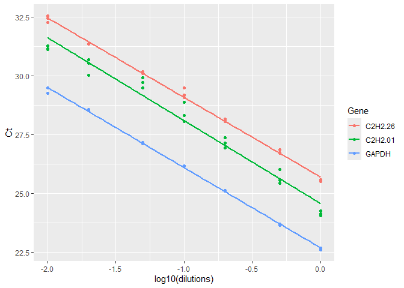
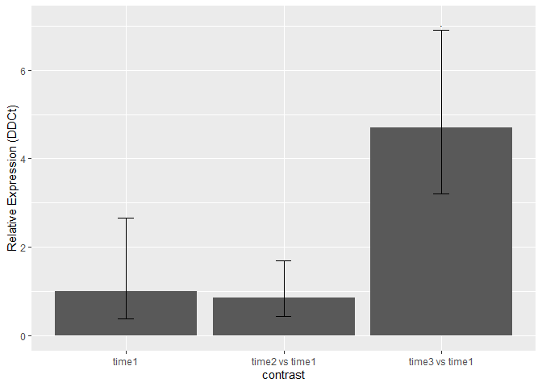
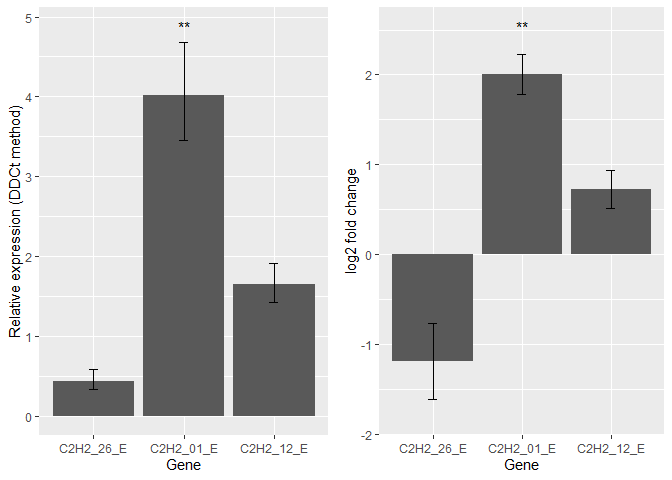
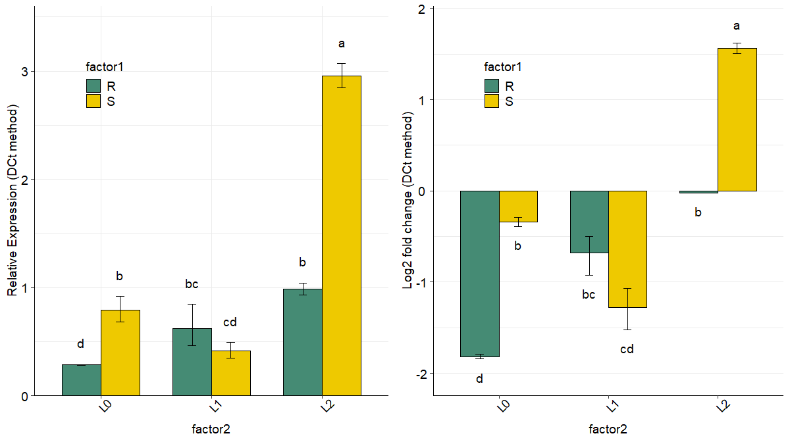
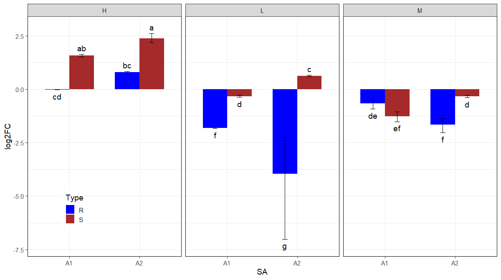

# Overview


'rtpcr' handles amplification efficiency estimation, statistical analysis, and graphical representation of quantitative real-time PCR (qPCR) data using one or more specified reference genes. The rtpcr package was developed for amplification efficiency calculation, statistical analysis, and graphical display of qPCR data in R. The rtpcr package uses a general calculation methodology that accounts for as many specified reference genes and amplification efficiency values, covering the Pfaffl method. Based on the experimental conditions, the functions of the rtpcr package use a t-test (for experiments with a two-level factor), analysis of variance (ANOVA), or analysis of covariance (ANCOVA) (where more than two levels or factors exists) to calculate the fold change (FC) or relative expression (RE) of a target gene. The functions also provide standard errors and confidence limits for the means and apply statistical mean comparisons. To facilitate function application, the rtpcr package includes different data sets as examples. The rtpcr package also provides ggplots with various editing arguments, allowing users to customize the graphical output.

A general calculation methodology described by <a href="https://doi.org/10.1186/s12859-017-1949-5">Ganger et al. (2017)</a>
and <a href="https://doi.org/10.1016/j.tibtech.2018.12.002">Taylor et al. (2019)</a>, matching both <a href="https://doi.org/10.1006/meth.2001.1262">Livak and Schmittgen (2001)</a> and <a href="https://doi.org/10.1093/nar/30.9.e36">Pfaffl et al. (2002) </a> methods  was implemented in the 'rtpcr' package. 'rtpcr' calculate the relative expression based on ${\Delta\Delta C_t}$  or ${\Delta C_t}$ method. 

## Installing and loading
The rtpcr package and source code are available for download from CRAN website (https://www.r-project.org) under GPL-3 license. The rtpcr package can be installed by running the following code in R:


``` r
# Installing from CRAN
install.packages("rtpcr")

# Loading the package
library(rtpcr)
```

# 2 Preparing dataframe
## 2.1 Data Structure for Non-Repeated Measures

To use the functions, input data should be prepared in the wide format with appropriate column arrangement. The correct column arrangement is shown in Table 1 and Table 2. For `TTEST_DDCt`, `ANOVA_DCt` and `ANOVA_DDCt`, each line should represent a separate individual, indicating a non-repeated measure experiment. The general column structure for these methods (assuming one reference gene) includes: condition columns, biological replicates, target gene efficiency ($E_{target}$), target Gene Ct ($Ct_{target}$), reference gene efficiency ($E_{ref}$), and reference gene Ct ($Ct_{ref}$). The package handles as many as specified reference genes.**Reference gene(s) should always be last**.

## 2.2 Data Structure for Repeated Measures

The `REPEATED_DDCt` function is used for observations repeatedly taken over time or courses. The input data frame must be structured such that:
1.  The **first column** is `id` (a unique number assigned to each individual sampled over time).
2.  This is followed by factor columns (which must include the `time` course levels).
3.  The remaining columns are efficiency and Ct values of target and reference genes.

## 2.3 Handling Blocking Factors

Variation between different qPCR plates can introduce noise; this can be accounted for using a blocking factor. By defining a `block` factor column, you ensure that at least one replicate of each condition is present on every plate. In the statistical models, the block effect is typically considered random, and its interaction with main effects is ignored.


*Table 1. Data structure and column arrangement required for ‘rtpcr’ package.  rep: technical replicate; targetE and refE: amplification efficiency columns for target and reference genes, respectively. targetCt and refCt: target gene and reference gene Ct columns, respectively. factors (up to three factors is allowed): experimental factors.*

 | Experiment type     |  Column arrangement of the input data   | Example in the package                   |
 |:---------------------|:---------------------------------------|:------------------------------------------|
 |Amplification efficiency             |Dilutions - geneCt ... | data_efficiency |
 |t-test (accepts multiple genes)      |condition (control level first) - rep - E and Ct columns of genes (reference gene(s) last.)| data_1factor_one_ref |
 |Factorial (Up to three factors)      |factor1 - rep - targetE - targetCt - refE - refCt | data_1factor |
 |                                     |factor1 - factor2 - rep - targetE - targetCt - refE - refCt | data_2factor |
 |                                     |factor1 - factor2 - factor3 - rep - targetE - targetCt - refE - refCt | data_3factor |
 |Factorial with blocking              |factor1 - block - rep - targetE - targetCt - refE - refCt | |
 |                                     |factor1 - factor2 - block - rep - targetE - targetCt - refE - refCt	 | data_2factorBlock |
 |                                     |factor1 - factor2 - factor3 - block - rep - targetE - targetCt - refE - refCt | |
 |Two reference genes                  |. . . . . .  rep - targetE - targetCt - ref1E - ref1Ct - ref2E - ref2Ct | |
 |calculating biological replicated    |. . . . . .  biologicalRep - techcicalRep - Etarget - targetCt - Eref - refCt  | data_withTechRep |
 |                |. . . . . .  biologicalRep - techcicalRep - Etarget - targetCt - ref1E - ref1Ct - ref2E - ref2Ct  | |
 

NOTE: For `TTEST_DDCt`, `ANOVA_DDCt` or `ANOVA_DCt` analysis, each line in the input data set belongs to a separate individual or biological replicate reflecting a non-repeated measure experiment.


*Table 2. Repeated measure data structure and column arrangement required for the `REPEATED_DDCt` function.  targetE and refE: amplification efficiency columns for target and reference genes, respectively. targetCt and refCt: Ct columns for target and reference genes, respectively. In the "id" column, a unique number is assigned to each individual, e.g. all the three number 1 indicate a single individual.*

 | Experiment type      |  Column arrangement of the input data   | Example in the package                   |
 |:---------------------|:----------------------------------------|:------------------------------------------|
 |Repeated measure      | id - time - targetE - targetCt - ref1E - ref1Ct | data_repeated_measure_1 |
 |                      | id - time - targetE - targetCt - ref1E - ref1Ct - ref2E - ref2Ct | |
  |Repeated measure     | id - treatment - time - targetE - targetCt - ref1E - ref1Ct | data_repeated_measure_2 |
 |                      | id - treatment - time - targetE - targetCt - ref1E - ref1Ct - ref2E - ref2Ct | |


To see list of data in the `rtpcr` package run `data(package = "rtpcr")`. 
Example data sets can be presented by running the name of each data set. A description of the columns names in  each data set is called by "?" followed by the names of the data set, for example `?data_1factor`


# 3. Amplification Efficiency

The `efficiency` function calculates the **amplification efficiency (E)**, slope, and $R^2$ statistics for genes based on a standard curve dilution series. It takes a data frame where the first column contains the dilutions.


``` r
# Applying the efficiency function
efficiency(data_efficiency)
```

```
## $Efficiency
##      Gene     Slope        R2        E
## 1 C2H2.26 -3.388094 0.9965504 1.973110
## 2 C2H2.01 -3.528125 0.9713914 1.920599
## 3   GAPDH -3.414551 0.9990278 1.962747
## 
## $Slope_compare
## $emtrends
##  variable log10(dilutions).trend     SE df lower.CL upper.CL
##  C2H2.26                   -3.39 0.0856 57    -3.56    -3.22
##  C2H2.01                   -3.53 0.0856 57    -3.70    -3.36
##  GAPDH                     -3.41 0.0856 57    -3.59    -3.24
## 
## Confidence level used: 0.95 
## 
## $contrasts
##  contrast          estimate    SE df t.ratio p.value
##  C2H2.26 - C2H2.01   0.1400 0.121 57   1.157  0.4837
##  C2H2.26 - GAPDH     0.0265 0.121 57   0.219  0.9740
##  C2H2.01 - GAPDH    -0.1136 0.121 57  -0.938  0.6186
## 
## P value adjustment: tukey method for comparing a family of 3 estimates 
## 
## 
## $plot
```

<!-- -->

The function returns the calculated statistics, standard curve plots, and, if more than two genes are present, a slope comparison table.

# 4. Relative Expression Analysis

## 4.1 $\Delta Ct$ Method (`ANOVA_DCt`)

The `ANOVA_DCt` function performs relative expression analysis using reference gene(s) as a normalizer. It returns a list containing:
*   `lm`: The linear model output including ANOVA tables.
*   `Result`: A table showing treatments, RE, Lower and Upper Confidence Limits (LCL, UCL), and a letter display for pair-wise comparisons.


``` r
# Example with three factors and one reference gene, without a blocking factor
ANOVA_DCt(data_3factor, numberOfrefGenes = 1, block = NULL)
```

```
## Analysis of Variance Table
## 
## Response: wDCt
##           Df Sum Sq Mean Sq F value    Pr(>F)    
## T         11 94.001  8.5456  29.188 3.248e-11 ***
## Residuals 24  7.027  0.2928                      
## ---
## Signif. codes:  0 '***' 0.001 '**' 0.01 '*' 0.05 '.' 0.1 ' ' 1
## 
## Relative expression (DCt method)
##    Type Conc SA     RE  log2FC    LCL    UCL     se Lower.se.RE Upper.se.RE
## 1     S    H A2 5.1934  2.3767 8.1197 3.3217 0.1309      4.7428      5.6867
## 2     S    H A1 2.9690  1.5700 4.6420 1.8990 0.0551      2.8578      3.0846
## 3     R    H A2 1.7371  0.7967 2.7159 1.1110 0.0837      1.6391      1.8409
## 4     S    L A2 1.5333  0.6167 2.3973 0.9807 0.0865      1.4441      1.6280
## 5     R    H A1 0.9885 -0.0167 1.5455 0.6323 0.0841      0.9325      1.0479
## 6     S    L A1 0.7955 -0.3300 1.2438 0.5088 0.2128      0.6864      0.9220
## 7     S    M A2 0.7955 -0.3300 1.2438 0.5088 0.2571      0.6657      0.9507
## 8     R    M A1 0.6271 -0.6733 0.9804 0.4011 0.4388      0.4626      0.8500
## 9     S    M A1 0.4147 -1.2700 0.6483 0.2652 0.2540      0.3477      0.4945
## 10    R    M A2 0.3150 -1.6667 0.4925 0.2015 0.2890      0.2578      0.3848
## 11    R    L A1 0.2852 -1.8100 0.4459 0.1824 0.0208      0.2811      0.2893
## 12    R    L A2 0.0641 -3.9633 0.1002 0.0410 0.8228      0.0362      0.1134
##    Lower.se.log2FC Upper.se.log2FC sig
## 1           2.1705          2.6025   a
## 2           1.5112          1.6311  ab
## 3           0.7517          0.8443  bc
## 4           0.5808          0.6548   c
## 5          -0.0177         -0.0157  cd
## 6          -0.3825         -0.2847   d
## 7          -0.3944         -0.2761   d
## 8          -0.9127         -0.4968  de
## 9          -1.5145         -1.0650  ef
## 10         -2.0363         -1.3641   f
## 11         -1.8363         -1.7841   f
## 12         -7.0103         -2.2407   g
```

``` r
# Example with a blocking factor
ANOVA_DCt(data_2factorBlock, block = "Block", numberOfrefGenes = 1)
```

```
## Analysis of Variance Table
## 
## Response: wDCt
##           Df  Sum Sq Mean Sq F value    Pr(>F)    
## block      1  0.0072  0.0072  0.0425    0.8404    
## T          5 20.5489  4.1098 24.1712 1.377e-05 ***
## Residuals 11  1.8703  0.1700                      
## ---
## Signif. codes:  0 '***' 0.001 '**' 0.01 '*' 0.05 '.' 0.1 ' ' 1
## 
## Relative expression (DCt method)
##   factor1 factor2     RE  log2FC    LCL    UCL     se Lower.se.RE Upper.se.RE
## 1       S      L2 2.9545  1.5629 4.2644 2.0470 0.0551      2.8438      3.0695
## 2       R      L2 0.9837 -0.0238 1.4198 0.6815 0.0841      0.9280      1.0427
## 3       S      L0 0.7916 -0.3371 1.1426 0.5485 0.2128      0.6831      0.9175
## 4       R      L1 0.6240 -0.6804 0.9006 0.4323 0.4388      0.4603      0.8458
## 5       S      L1 0.4126 -1.2771 0.5956 0.2859 0.2540      0.3460      0.4921
## 6       R      L0 0.2838 -1.8171 0.4096 0.1966 0.0208      0.2797      0.2879
##   Lower.se.log2FC Upper.se.log2FC sig
## 1          1.5044          1.6237   a
## 2         -0.0252         -0.0224   b
## 3         -0.3907         -0.2908   b
## 4         -0.9223         -0.5020  bc
## 5         -1.5230         -1.0709  cd
## 6         -1.8435         -1.7911   d
```

## 4.2 $\Delta \Delta Ct$ Method

### 4.2.1  ANOVA using (`ANOVA_DDCt`)

The `ANOVA_DDCt` function is designed for $\Delta \Delta Ct$ analysis in uni- or multi-factorial experiments, using either ANOVA or ANCOVA.

**Required Arguments:** You must specify the `mainFactor.column` for which relative expression (RE) is calculated.

**Calibrator Selection:**
The **calibrator** (reference level) is the sample used for comparison, and its resulting RE value is 1. By default, the first level of the `mainFactor.column` is used as the calibrator. You can override this default using the `mainFactor.level.order` argument, where the first level listed in the vector will serve as the calibrator.

**Analysis Type:**
1.  **ANOVA (`analysisType = "anova"`):** Performs analysis based on a full model factorial experiment.
2.  **ANCOVA (`analysisType = "ancova"`):** The remaining factors (if any) are treated as covariate(s) in the analysis of variance.

**Important ANCOVA Consideration:** If the interaction between the main factor and the covariate is significant, ANCOVA is generally not appropriate. ANCOVA is primarily used when a factor is affected by uncontrolled quantitative covariate(s).

**Output:** The function returns both the `ANOVA_table` and `ANCOVA_table`, along with an `RE Table` providing relative expression values, log2 Fold Change (`log2FC`), significance, and confidence intervals. It also returns bar plots based on "RE" or "log2FC".


``` r
# Example using two factors with a blocking factor and ANCOVA
ANOVA_DDCt(data_2factorBlock,
numberOfrefGenes = 1,
mainFactor.column = 1,
block = "block",
analysisType = "anova")
```

```
## boundary (singular) fit: see help('isSingular')
```

```
## NOTE: Results may be misleading due to involvement in interactions
```

```
## ANOVA table 
## Type III Analysis of Variance Table with Satterthwaite's method
##                  Sum Sq Mean Sq NumDF DenDF F value    Pr(>F)    
## block            0.0035  0.0035     1     1  0.0228  0.904592    
## factor1          3.0505  3.0505     1    10 19.6368  0.001271 ** 
## factor2         12.9530  6.4765     2    10 41.6916 1.408e-05 ***
## factor1:factor2  4.5454  2.2727     2    10 14.6303  0.001072 ** 
## ---
## Signif. codes:  0 '***' 0.001 '**' 0.01 '*' 0.05 '.' 0.1 ' ' 1
## 
## ANCOVA table
## Type III Analysis of Variance Table with Satterthwaite's method
##          Sum Sq Mean Sq NumDF DenDF F value    Pr(>F)    
## block    0.0072  0.0072     1    13  0.0146 0.9055452    
## factor2 12.9530  6.4765     2    13 13.1231 0.0007602 ***
## factor1  3.0505  3.0505     1    13  6.1810 0.0272912 *  
## ---
## Signif. codes:  0 '***' 0.001 '**' 0.01 '*' 0.05 '.' 0.1 ' ' 1
## 
## Expression table
##   contrast     RE log2FC pvalue sig    LCL    UCL     se Lower.se.RE
## 1        R 1.0000 0.0000 1.0000     0.0000 0.0000 0.2920      0.8168
## 2   S vs R 1.7695 0.8233 0.0013  ** 1.3281 2.3576 0.4288      1.3145
##   Upper.se.RE Lower.se.log2FC Upper.se.log2FC
## 1      1.2243          0.0000          0.0000
## 2      2.3819          0.6117          1.1083
## RE_Plot
```

<!-- -->

```
## *** The R level was used as calibrator.
```

### 4.2.2 Repeated Measure Analysis (`REPEATED_DDCt`)

The `REPEATED_DDCt` function is specialized for $\Delta \Delta C_T$ analysis of repeated measure data, where observations are taken over different time courses from the same individuals.

The analysis uses a mixed linear model where `id` (individual) is a random effect. You must specify the `factor` (e.g., "time") for which fold change (FC) values are analyzed.


``` r
# Example for repeated measures data (time is the factor of interest)
REPEATED_DDCt(data_repeated_measure_1,
numberOfrefGenes = 1,
factor = "time", 
calibratorLevel = "1",
block = NULL)
```

```
## Type III Analysis of Variance Table with Satterthwaite's method
##      Sum Sq Mean Sq NumDF DenDF F value  Pr(>F)  
## time 11.073  5.5364     2     4  4.5382 0.09357 .
## ---
## Signif. codes:  0 '***' 0.001 '**' 0.01 '*' 0.05 '.' 0.1 ' ' 1
## 
## Expression table
##         contrast     RE  log2FC pvalue sig    LCL     UCL     se Lower.se.RE
## 1          time1 1.0000  0.0000 1.0000     0.0000  0.0000 1.4051      0.3776
## 2 time2 vs time1 0.8566 -0.2233 0.8166     0.0923  7.9492 0.9753      0.4357
## 3 time3 vs time1 4.7022  2.2333 0.0685   . 0.5067 43.6368 0.5541      3.2026
##   Upper.se.RE Lower.se.log2FC Upper.se.log2FC
## 1      2.6483          0.0000          0.0000
## 2      1.6840         -0.4391         -0.1136
## 3      6.9040          1.5211          3.2791
## 
## Expression plot
```

<!-- -->

```
## The level 1  of the selected factor was used as calibrator.
```

### 4.2.3 T-Test Analysis (`TTEST_DDCt`)

The `TTEST_DDCt` function is used for $\Delta \Delta C_T$ expression analysis of target genes evaluated under two conditions (control vs. treatment).

**Data Requirements:** Input must be a data frame of columns including condition (control level first) - rep - E and Ct columns of genes (reference gene(s) last.). Replicates must be equal for all genes.

**Sample Types:**
*   **Paired:** Samples are collected from one set of individuals at two different conditions (e.g., before and after treatment), reducing inter-individual variability.
*   **Unpaired:** Two distinct sets of individuals are used (one untreated, one treated).

The function allows specification of `paired` (logical) and whether variances are equal (`var.equal`).


``` r
# Example for unpaired t-test based analysis

p1 <- TTEST_DDCt(data_1factor_one_ref,
               numberOfrefGenes = 1,
               paired = FALSE,
               var.equal = TRUE,
               plotType = "RE")
```

```
## *** 3 target(s) using 1 reference gene(s) was analysed!
## *** The control level was used as calibrator.
```

``` r
p2 <- TTEST_DDCt(data_1factor_one_ref,
                 numberOfrefGenes = 1,
                 paired = FALSE,
                 var.equal = TRUE,
                 plotType = "log2FC")
```

```
## *** 3 target(s) using 1 reference gene(s) was analysed!
## *** The control level was used as calibrator.
```

``` r
p1 <- p1$plot
p2 <- p2$plot
rtpcr::multiplot(p1,p2,cols = 2)
```

<!-- -->


# 5. Visualization Functions

The `rtpcr` package includes dedicated plotting functions for visualizing the results returned in the statistics tables (e.g., `Result` or `RE Table`) from the analysis functions. These plots generally include bar height based on RE or log2FC, and error bars representing standard error (se) or confidence interval (ci), along with optional mean grouping letters derived from multiple comparisons.

*   `plotOneFactor`: Generates a bar plot for single-factor experimental results. It requires column indices specifying the x-axis factor, y-axis value, lower error bar, upper error bar, and optionally, the grouping letters.


``` r
# Before plotting, the result table needs to be extracted:
p1 <- TTEST_DDCt(data_1factor_one_ref,
                 numberOfrefGenes = 1,
                 paired = FALSE,
                 var.equal = TRUE,
                 plotType = "RE")
```

```
## *** 3 target(s) using 1 reference gene(s) was analysed!
## *** The control level was used as calibrator.
```

``` r
p2 <- TTEST_DDCt(data_1factor_one_ref,
                 numberOfrefGenes = 1,
                 paired = FALSE,
                 var.equal = TRUE,
                 plotType = "log2FC")
```

```
## *** 3 target(s) using 1 reference gene(s) was analysed!
## *** The control level was used as calibrator.
```

``` r
d1 <- p1$Result

# preserve order in plot as in data
d1$Gene <- factor(d1$Gene, levels = unique(d1$Gene))

pl1 <- plotOneFactor(
  d1,
  x_col = 1,
  y_col = 2,
  Lower.se_col = 8,
  Upper.se_col = 9,
  letters_col = 10,
  letters_d = 0.2,
  col_width = 0.8,
  err_width = 0.15,
  fill_colors = "cyan",
  colour = "black",
  alpha = 1,
  base_size = 12,
  legend_position = "none")

pl2 <- plotOneFactor(
  d1,
  x_col = 1,
  y_col = 7,
  Lower.se_col = 11,
  Upper.se_col = 12,
  letters_col = 10,
  letters_d = 0.2,
  col_width = 0.8,
  err_width = 0.15,
  fill_colors = "cyan",
  colour = "black",
  alpha = 1,
  base_size = 12,
  legend_position = "none")

multiplot(pl1, pl2, cols =  2)
```

<!-- -->

*   `plotTwoFactor`: Creates a bar plot for two-factorial experiment results, using one factor for the x-axis and the second factor for bar fill/grouping.


``` r
a <- ANOVA_DCt(data_2factorBlock, block = "Block", numberOfrefGenes = 1)
```

```
## Analysis of Variance Table
## 
## Response: wDCt
##           Df  Sum Sq Mean Sq F value    Pr(>F)    
## block      1  0.0072  0.0072  0.0425    0.8404    
## T          5 20.5489  4.1098 24.1712 1.377e-05 ***
## Residuals 11  1.8703  0.1700                      
## ---
## Signif. codes:  0 '***' 0.001 '**' 0.01 '*' 0.05 '.' 0.1 ' ' 1
## 
## Relative expression (DCt method)
##   factor1 factor2     RE  log2FC    LCL    UCL     se Lower.se.RE Upper.se.RE
## 1       S      L2 2.9545  1.5629 4.2644 2.0470 0.0551      2.8438      3.0695
## 2       R      L2 0.9837 -0.0238 1.4198 0.6815 0.0841      0.9280      1.0427
## 3       S      L0 0.7916 -0.3371 1.1426 0.5485 0.2128      0.6831      0.9175
## 4       R      L1 0.6240 -0.6804 0.9006 0.4323 0.4388      0.4603      0.8458
## 5       S      L1 0.4126 -1.2771 0.5956 0.2859 0.2540      0.3460      0.4921
## 6       R      L0 0.2838 -1.8171 0.4096 0.1966 0.0208      0.2797      0.2879
##   Lower.se.log2FC Upper.se.log2FC sig
## 1          1.5044          1.6237   a
## 2         -0.0252         -0.0224   b
## 3         -0.3907         -0.2908   b
## 4         -0.9223         -0.5020  bc
## 5         -1.5230         -1.0709  cd
## 6         -1.8435         -1.7911   d
```

``` r
data <- a$Results

p1 <- plotTwoFactor(
  data = data,
  x_col = 2,
  y_col = 3,
  group_col = 1,
  Lower.se_col = 8,
  Upper.se_col = 9,
  letters_col = 12,
  letters_d = 0.2,
  fill_colors = c("aquamarine4", "gold2"),
  alpha = 1,
  col_width = 0.7,
  dodge_width = 0.7,
  base_size = 14, 
  legend_position = c(0.2, 0.8),
  color = "black"
)

library(ggplot2)
p1 <- p1 + scale_y_continuous(breaks = seq(0, 3.6, by = 1),
                        limits = c(0, 3.6),
                        expand = c(0, 0)) + 
  theme(axis.text.x = element_text(size = 14, color = "black", angle = 45),
        axis.text.y = element_text(size = 14,color = "black", angle = 0, hjust = 0.5)) +
  theme(legend.text = element_text(colour = "black", size = 14),
        legend.background = element_rect(fill = "transparent")) +
  ylab("Relative Expression (DCt method)")


p2 <- plotTwoFactor(
  data = data,
  x_col = 2,
  y_col = 4,
  group_col = 1,
  Lower.se_col = 10,
  Upper.se_col = 11,
  letters_col = 12,
  letters_d = 0.2,
  fill_colors = c("aquamarine4", "gold2"),
  alpha = 1,
  col_width = 0.7,
  dodge_width = 0.7,
  base_size = 14, 
  legend_position = c(0.2, 0.8),
  color = "black"
)


p2 <- p2 + 
  scale_y_continuous(expand = c(-1.44, +1.5)) + 
  theme(axis.text.x = element_text(size = 14, color = "black", angle = 45),
        axis.text.y = element_text(size = 14,color = "black", angle = 0, hjust = 0.5)) +
  theme(legend.text = element_text(colour = "black", size = 14),
        legend.background = element_rect(fill = "transparent")) +
  #geom_hline(yintercept = 0, color = "black",  linewidth = 0.6, linetype = "solid") +
  theme(
    panel.grid.major.x = element_blank(),
    panel.grid.minor.x = element_blank()) +
  ylab("Log2 fold change (DCt method)")

multiplot(p1, p2, cols =  2)
```



*   `plotThreeFactor`: Generates a bar plot for three-factorial experiment results, typically utilizing facet grids to display the third factor.

The utility function `multiplot` is available to combine multiple `ggplot` objects (such as those generated by the `plotOneFactor`, `plotTwoFactor`, etc.) into a single plate, specifying the number of columns desired.


``` r
res <- ANOVA_DCt(data_3factor, 
      numberOfrefGenes = 1, 
      block = NULL)
```

```
## Analysis of Variance Table
## 
## Response: wDCt
##           Df Sum Sq Mean Sq F value    Pr(>F)    
## T         11 94.001  8.5456  29.188 3.248e-11 ***
## Residuals 24  7.027  0.2928                      
## ---
## Signif. codes:  0 '***' 0.001 '**' 0.01 '*' 0.05 '.' 0.1 ' ' 1
## 
## Relative expression (DCt method)
##    Type Conc SA     RE  log2FC    LCL    UCL     se Lower.se.RE Upper.se.RE
## 1     S    H A2 5.1934  2.3767 8.1197 3.3217 0.1309      4.7428      5.6867
## 2     S    H A1 2.9690  1.5700 4.6420 1.8990 0.0551      2.8578      3.0846
## 3     R    H A2 1.7371  0.7967 2.7159 1.1110 0.0837      1.6391      1.8409
## 4     S    L A2 1.5333  0.6167 2.3973 0.9807 0.0865      1.4441      1.6280
## 5     R    H A1 0.9885 -0.0167 1.5455 0.6323 0.0841      0.9325      1.0479
## 6     S    L A1 0.7955 -0.3300 1.2438 0.5088 0.2128      0.6864      0.9220
## 7     S    M A2 0.7955 -0.3300 1.2438 0.5088 0.2571      0.6657      0.9507
## 8     R    M A1 0.6271 -0.6733 0.9804 0.4011 0.4388      0.4626      0.8500
## 9     S    M A1 0.4147 -1.2700 0.6483 0.2652 0.2540      0.3477      0.4945
## 10    R    M A2 0.3150 -1.6667 0.4925 0.2015 0.2890      0.2578      0.3848
## 11    R    L A1 0.2852 -1.8100 0.4459 0.1824 0.0208      0.2811      0.2893
## 12    R    L A2 0.0641 -3.9633 0.1002 0.0410 0.8228      0.0362      0.1134
##    Lower.se.log2FC Upper.se.log2FC sig
## 1           2.1705          2.6025   a
## 2           1.5112          1.6311  ab
## 3           0.7517          0.8443  bc
## 4           0.5808          0.6548   c
## 5          -0.0177         -0.0157  cd
## 6          -0.3825         -0.2847   d
## 7          -0.3944         -0.2761   d
## 8          -0.9127         -0.4968  de
## 9          -1.5145         -1.0650  ef
## 10         -2.0363         -1.3641   f
## 11         -1.8363         -1.7841   f
## 12         -7.0103         -2.2407   g
```

``` r
data <- res$Results

p <- plotThreeFactor(
  data,
  x_col = 3,        # x-axis factor
  y_col = 5,        # bar height
  group_col = 1,    # grouping (fill)
  facet_col = 2,    # faceting factor
  Lower.se_col = 11,
  Upper.se_col = 12,
  letters_col = 13,
  letters_d = 0.3,
  col_width = 0.7, 
  dodge_width = 0.7,# controls spacing
  fill_colors = c("blue", "brown"),
  base_size = 16, 
  alpha = 1,
  legend_position = c(0.1, 0.2)
)

library(ggplot2)
p + theme(
  panel.border = element_rect(color = "black", fill = NA, linewidth = 0.5)
)
```




# 6. Post-Hoc and Model Interpretation

## `Means_DDCt`

This function facilitates post-hoc analysis by taking a fitted model object (produced by `ANOVA_DDCt` or `REPEATED_DDCt`) and calculating fold change (FC) values for specific effects.

You specify the effects of interest using the `specs` argument. This allows for the calculation of simple effects, interactions, and slicing, provided an ANOVA model was used. Note that ANCOVA models returned by this package only include simple effects in the `Means_DDCt` output.


``` r
# Returning fold change values of Conc levels sliced by Type
# Returning fold change values from a fitted model.
# Firstly, result of `qpcrANOVAFC` or `qpcrREPEATED` is 
# acquired which includes a model object:
# Assume 'res' is the result from ANOVA_DDCt
res <- ANOVA_DDCt(data_3factor, numberOfrefGenes = 1, mainFactor.column = 1, block = NULL)
```

```
## NOTE: Results may be misleading due to involvement in interactions
```

```
## ANOVA table 
## Type III Analysis of Variance Table with Satterthwaite's method
##              Sum Sq Mean Sq NumDF DenDF F value    Pr(>F)    
## Type         24.834 24.8336     1    24 84.8207 2.392e-09 ***
## Conc         45.454 22.7269     2    24 77.6252 3.319e-11 ***
## SA            0.032  0.0324     1    24  0.1107 0.7422762    
## Type:Conc    10.641  5.3203     2    24 18.1718 1.567e-05 ***
## Type:SA       6.317  6.3168     1    24 21.5756 0.0001024 ***
## Conc:SA       3.030  1.5150     2    24  5.1747 0.0135366 *  
## Type:Conc:SA  3.694  1.8470     2    24  6.3086 0.0062852 ** 
## ---
## Signif. codes:  0 '***' 0.001 '**' 0.01 '*' 0.05 '.' 0.1 ' ' 1
## 
## ANCOVA table
## Type III Analysis of Variance Table with Satterthwaite's method
##      Sum Sq Mean Sq NumDF DenDF F value    Pr(>F)    
## SA    0.032  0.0324     1    31  0.0327    0.8577    
## Conc 45.454 22.7269     2    31 22.9429 7.682e-07 ***
## Type 24.834 24.8336     1    31 25.0696 2.105e-05 ***
## ---
## Signif. codes:  0 '***' 0.001 '**' 0.01 '*' 0.05 '.' 0.1 ' ' 1
## 
## Expression table
##   contrast     RE log2FC pvalue sig    LCL    UCL     se Lower.se.RE
## 1        R 1.0000 0.0000      1     0.0000 0.0000 0.3939      0.7611
## 2   S vs R 3.1626 1.6611      0 *** 2.4433 4.0936 0.3064      2.5575
##   Upper.se.RE Lower.se.log2FC Upper.se.log2FC
## 1      1.3139          0.0000          0.0000
## 2      3.9109          1.3433          2.0542
## RE_Plot
```

<!-- -->

```
## *** The R level was used as calibrator.
```

``` r
Means_DDCt(res$lm_ANOVA, specs = "Conc * Type")
```

```
##  contrast          FC        SE df       LCL      UCL p.value sig
##  L R vs H R  0.103187 0.3123981 22  0.065856  0.16168 <0.0001 ***
##  M R vs H R  0.339151 0.3123981 22  0.216453  0.53140 <0.0001 ***
##  H S vs H R  2.996614 0.3123981 22  1.912499  4.69527 <0.0001 ***
##  L S vs H R  0.842842 0.3123981 22  0.537918  1.32061  0.4382    
##  M S vs H R  0.438303 0.3123981 22  0.279734  0.68676  0.0010 ***
##  M R vs L R  3.286761 0.3123981 22  2.097677  5.14989 <0.0001 ***
##  H S vs L R 29.040613 0.3123981 22 18.534303 45.50251 <0.0001 ***
##  L S vs L R  8.168097 0.3123981 22  5.213044 12.79824 <0.0001 ***
##  M S vs L R  4.247655 0.3123981 22  2.710939  6.65547 <0.0001 ***
##  H S vs M R  8.835632 0.3123981 22  5.639078 13.84418 <0.0001 ***
##  L S vs M R  2.485151 0.3123981 22  1.586073  3.89388  0.0004 ***
##  M S vs M R  1.292353 0.3123981 22  0.824806  2.02493  0.2489    
##  L S vs H S  0.281265 0.3123981 22  0.179509  0.44070 <0.0001 ***
##  M S vs H S  0.146266 0.3123981 22  0.093350  0.22918 <0.0001 ***
##  M S vs L S  0.520030 0.3123981 22  0.331894  0.81481  0.0063 ** 
## 
## Results are averaged over the levels of: SA 
## Degrees-of-freedom method: kenward-roger 
## Confidence level used: 0.95
```

``` r
res2 <- Means_DDCt(res$lm_ANOVA, specs = "Conc | Type")

# Returning fold change values of Conc levels sliced by Type*SA interaction
Means_DDCt(res$lm_ANOVA, specs = "Conc | (Type*SA)")
```

```
## Type = R, SA = A1:
##  contrast       FC        SE df       LCL      UCL p.value sig
##  L vs H   0.288505 0.4417977 22 0.1528761 0.544460  0.0005 ***
##  M vs H   0.634342 0.4417977 22 0.3361323 1.197118  0.1514    
##  M vs L   2.198724 0.4417977 22 1.1650843 4.149389  0.0174 *  
## 
## Type = S, SA = A1:
##  contrast       FC        SE df       LCL      UCL p.value sig
##  L vs H   0.267943 0.4417977 22 0.1419808 0.505657  0.0003 ***
##  M vs H   0.139661 0.4417977 22 0.0740051 0.263565 <0.0001 ***
##  M vs L   0.521233 0.4417977 22 0.2761966 0.983660  0.0448 *  
## 
## Type = R, SA = A2:
##  contrast       FC        SE df       LCL      UCL p.value sig
##  L vs H   0.036906 0.4417977 22 0.0195562 0.069648 <0.0001 ***
##  M vs H   0.181327 0.4417977 22 0.0960836 0.342197 <0.0001 ***
##  M vs L   4.913213 0.4417977 22 2.6034674 9.272118 <0.0001 ***
## 
## Type = S, SA = A2:
##  contrast       FC        SE df       LCL      UCL p.value sig
##  L vs H   0.295248 0.4417977 22 0.1564494 0.557187  0.0006 ***
##  M vs H   0.153184 0.4417977 22 0.0811706 0.289085 <0.0001 ***
##  M vs L   0.518830 0.4417977 22 0.2749233 0.979125  0.0434 *  
## 
## Degrees-of-freedom method: kenward-roger 
## Confidence level used: 0.95
```


# How to edit ouptput graphs?
the rtpcr graphical functions create ggplot objects can easily be edited by adding new layers after calling the ggplot2 package:


``` r
Example 1
p2 <- plotTwoFactor(
  data = data,
  x_col = 2,
  y_col = 4,
  group_col = 1,
  Lower.se_col = 10,
  Upper.se_col = 11,
  letters_col = 12,
  letters_d = 0.2,
  fill_colors = c("aquamarine4", "gold2"),
  alpha = 1,
  col_width = 0.7,
  dodge_width = 0.7,
  base_size = 16, 
  legend_position = c(0.2, 0.8)
)

library(ggplot2)
p2 + scale_y_continuous(expand = c(-1.5, +1.5)) + 
  theme(axis.text.x = element_text(size = 14, color = "black", angle = 45),
        axis.text.y = element_text(size = 14,color = "black", angle = 0, hjust = 0.5)) +
  theme(legend.text = element_text(colour = "black", size = 14),
        legend.background = element_rect(fill = "transparent"))
```

# Citation


``` r
citation("rtpcr")
```

```
## To cite package 'rtpcr' in publications use:
## 
##   Ghader Mirzaghaderi (2025). rtpcr: A package for statistical analysis
##   and graphical presentation of qPCR data in R. PeerJ 13:e20185.
##   https://doi.org/10.7717/peerj.20185
## 
## A BibTeX entry for LaTeX users is
## 
##   @Article{,
##     title = {rtpcr: A package for statistical analysis and graphical presentation of qPCR data in R},
##     author = {Ghader Mirzaghaderi},
##     journal = {PeerJ},
##     volume = {13},
##     pages = {e20185},
##     year = {2025},
##     doi = {10.7717/peerj.20185},
##   }
```


# Contact 
Email: gh.mirzaghaderi at uok.ac.ir


# References
Livak, Kenneth J, and Thomas D Schmittgen. 2001. Analysis of Relative Gene Expression Data Using Real-Time Quantitative PCR and the Double Delta CT Method. Methods 25 (4). <a href="https://doi.org/10.1006/meth.2001.1262">doi.org/10.1006/meth.2001.1262</a>.

Ganger, MT, Dietz GD, Ewing SJ. 2017. A common base method for analysis of qPCR data and the application of simple blocking in qPCR experiments. BMC bioinformatics 18, 1-11. <a href="https://doi.org/10.1186/s12859-017-1949-5">doi.org/10.1186/s12859-017-1949-5</a>.

Mirzaghaderi G. 2025. rtpcr: A package for statistical analysis and graphical presentation of qPCR data in R. PeerJ 13, e20185. <a href="https://doi.org/10.7717/peerj.20185">doi.org/10.7717/peerj.20185</a>.

Pfaffl MW, Horgan GW, Dempfle L. 2002. Relative expression software tool (REST©) for group-wise comparison and statistical analysis of relative expression results in real-time PCR. Nucleic acids research 30, e36-e36. <a href="https://doi.org/10.1093/nar/30.9.e36">doi.org/10.1093/nar/30.9.e36</a>.

Taylor SC, Nadeau K, Abbasi M, Lachance C, Nguyen M, Fenrich, J. 2019. The ultimate qPCR experiment: producing publication quality, reproducible data the first time. Trends in Biotechnology, 37(7), 761-774. <a href="https://doi.org/10.1016/j.tibtech.2018.12.002">doi.org/10.1016/j.tibtech.2018.12.002</a>.

Yuan, JS, Ann Reed, Feng Chen, and Neal Stewart. 2006. Statistical Analysis of Real-Time PCR Data. BMC Bioinformatics 7 (85). <a href="https://doi.org/10.1186/1471-2105-7-85">doi.org/10.1186/1471-2105-7-85</a>.
