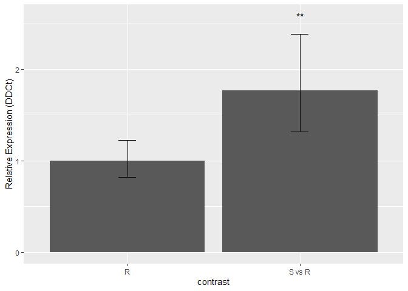
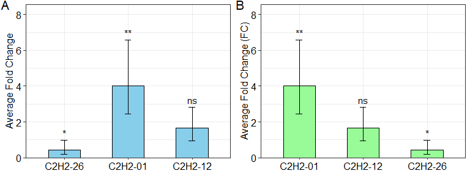
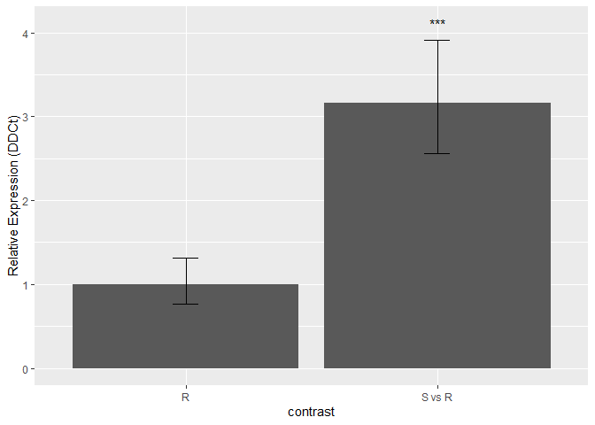
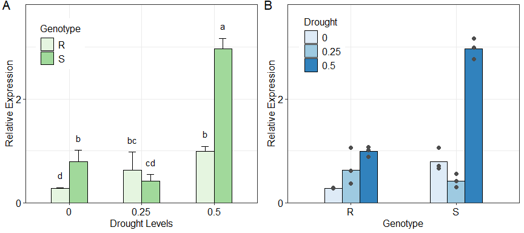

# Overview


Real-time polymerase chain reaction (real-time PCR), is widely used in biological research. Various analysis methods are employed on the real-time PCR data to measure the mRNA levels under different experimental conditions. 
‘rtpcr’ package was developed for amplification efficiency calculation and statistical analysis of real-time PCR data in R. By accounting for up to two reference genes and amplification efficiency values, a general calculation methodology described by <a href="https://doi.org/10.1186/s12859-017-1949-5">Ganger et al. (2017)</a>, matching both <a href="https://doi.org/10.1006/meth.2001.1262">Livak and Schmittgen (2001)</a> and <a href="https://doi.org/10.1093/nar/30.9.e36">Pfaffl et al. (2002) </a> methods  was used. Based on the experimental conditions, the functions of the ‘rtpcr’ package use a t-test (for experiments with a two-level factor) or analysis of variance (for cases where more than two levels or factors or a blocking factor exist) to calculate the fold change (FC) or relative expression (RE). The functions further provide standard deviations and confidence limits for means, apply statistical mean comparisons and present letter mean grouping. To facilitate function application, different data sets were used as examples and the outputs were explained. An outstanding feature of ‘rtpcr’ package is providing publication-ready bar plots with various controlling arguments for experiments with up to three different factors.

# Calculation methods
The basic method for expression estimation of a gene between conditions relies on the calculation of fold differences by means of the PCR amplification efficiency (E) and the threshold cycle (syn. crossing point or Ct). Among the various approaches developed for data analysis in real-time PCR, the Livak approach, also known as the $2^{-\Delta\Delta C_t}$ method, stands out for its simplicity and widespread use where the fold change (FC) exoression ($2^{-\Delta\Delta C_t}$) in Treatment (Tr) compared to Control (Co) condition is calculated according to equation:


$$\begin{align*}
\text{Fold change} & = 2^{-\Delta\Delta C_t} \\
& = \frac{2^{-(C_{t_{\text{target}}}-C_{t_{\text{ref}}})_{Tr}}}
{2^{-(C_{t_{\text{target}}}-C_{t_{\text{ref}}})_{Co}}} \\ 
& =2^{-[(C_{t_{\text{target}}}-C_{t_{\text{ref}}})_{\text{Tr}}-
{(C_{t_{\text{target}}}-C_{t_{\text{ref}}})}_{\text{Co}}]} \\ 
& = 2^{-[{(\Delta C_t)_{Tr} - (\Delta C_t)_{Co}}]}
\end{align*}$$


Here, $\Delta C_t$ is the difference between two Ct values (e.g. Cttarget−Ctref) and target and ref are target gene and reference genes, respectively. This method assumes that both the target and reference genes are amplified with efficiencies close to 100%, allowing for the relative quantification of gene expression levels 
This method assumes that both the target and reference genes are amplified with efficiencies close to 100%, allowing for the relative quantification of gene expression levels.

On the other hand, the Pfaffl method offers a more flexible approach by accounting for differences in amplification efficiencies between the target and reference genes. This method adjusts the calculated expression ratio by incorporating the specific amplification efficiencies, thus providing a more accurate representation of the relative gene expression levels.

$$\text{Fold change} = \frac{E^{-(C_{t_{\text{Tr}}}-C_{t_{\text{Co}}})_{target}}}
{E^{-(C_{t_{\text{Tr}}}-C_{t_{\text{Co}}})_{ref}}}$$

# A generalized calculation method
The rtpcr package was developed for the R environment (www.r-project.org) in the major operating systems. The packager functions are mainly based on the calculation of efficiency-weighted $\Delta C_t$ ($w\Delta C_t$) values from target and reference gene Ct (equation 3). $w\Delta C_t$  values are weighted for the amplification efficiencies as described by Ganger et al. (2017):


$$w\Delta Ct =\log_{10}(E_{target}).Ct_{target}-\log_{10}(E_{ref}).Ct_{ref}$$

From the mean wΔCt values over biological replicates, relative expression (RE) of a target gene can be calculated for each condition according to the equation 

$$\text{Relative Expression} = 10^{-\overline{w\Delta Ct}}$$
When there are only a two conditional factor (e.g. with treatment and control levels), or there is one multi-level factor that one of them is concidered as control, average fold change (FC) expression of target gene can be calculated according to:

$$\text{Fold Change}=10^{-(\overline{w\Delta Ct}_{\text{Tr}}-{\overline{w\Delta Ct}_{\text{Co}}})}$$

in rtpcr package, ‘qpcrTTEST’, ‘qpcrTTESTplot’ finctions calcualtes FC for multi-genes-two conditional cases and ‘oneFACTORfcplot’ represents FC for single-gene-multi conditional factor cases that one of the levels can be concidered as check. If wDCt values is calculated from the E valuses, these calculations match the formula of Pfaffl while if 2 (complete efficiency) be used instead, the result match the $2^{-\Delta\Delta C_t}$ method. In any case we called these as Fold Change in the outputs of ‘rtpcr’. Under factorial experiments where the calculation of the expression of the target gene relative to the reference gene (called Relative Expression) in each condition is desired, ‘qpcrANOVA’, ‘oneFACTORplot’, ‘twoFACTORplot’ and ‘threeFACTORplot’ functions were developed for ANOVA analysis, and representing the plots from single, double or triple factor experiments, respectively. The last three functions generate ‘ggplot2’-derived graphs based on the output of the ‘qpcrANOVA’ function. If available, the blocking factor can laso be handled by ‘qpcrTTEST’ and ‘qpcrANOVA’ functions.
Here, a brief methodology is presented but detailes about the $w\Delta C_t$  calculations and statistical analysis are available in. Importantly, because the relative or FC gene expression follow a lognormal distribution, a normal distribution is expected for the $w\Delta C_t$ or $w\Delta\Delta C_t$ values making it possible to apply t-test or analysis of variance to them. Following analysis, $w\Delta C_t$ values are statistically compared and standard deviations and confidence intervals is calculated, but the transformation $y = 10^x$ is applied in the final step in order to report the results (i.e. RE ratios, errors and confidence limits).


# Installing and loading


The rtpcr package and source code are available for download from CRAN website (http://www.r-project.org) under GPL-3 license and can be installed and loaded using:
```r
install.packages("rtpcr")
library(rtpcr)
```

Alternatively, the `rtpcr` with the latest changes can be installed by running the following code in your R software: 


```r
# install `rtpcr` from github (under development)

devtools::install_github("mirzaghaderi/rtpcr")

# I strongly recommend to install the package with the vignette as it contains information about how to use the 'rtpcr' package. Through the following code, Vignette is installed as well.

devtools::install_github("mirzaghaderi/rtpcr", build_vignettes = TRUE)
```


# Data structure and column arrangement

To use the functions, input data should be prepared in the right format with appropriate column arrangement. The correct column arrangement is shown in Table 1.

*Table 1. Data structure and column arrangement required for ‘rtpcr’ package.  rep: technical replicate; targetE and refE: amplification efficiency columns for target and reference genes respectively. targetCt and refCt: target and reference Ct columns, respectively. factors (factor1, factor2 and/or factor3): experimental factors.*

| Experiment type   |                  Column arrangement of the input data | Example in the package |
 |:---------------------|:-----------------------------------|:----------------------------------|
 |Amplification efficiency             |Dilutions - targetCt - refCt | data_efficiency |
 |t-test (accepts multiple genes)      |condition (put the control level first) - efficiency - gene (put reference gene(s) last.) - Ct  | data_ttest |
 |Factorial (Up to three factors)      |factor1 - rep - targetE - targetCt - refE - refCt | data_1factor |
 |                                     |factor1 - factor2 - rep - targetE - targetCt - refE - refCt | data_2factor |
 |                                     |factor1 - factor2 - factor3 - rep - targetE - targetCt - refE - refCt | data_3factor_b |
 |Factorial with blocking              |factor1 - block - rep - targetE - targetCt - refE - refCt | |
 |                                     |factor1 - factor2 - block - rep - targetE - targetCt - refE - refCt	 | data_2factorBlock |
 |                                     |factor1 - factor2 - factor3 - block - rep - targetE - targetCt - refE - refCt | |
 |Two reference genes                  |. . . . . .  rep - targetE - targetCt - ref1E - ref1Ct - ref2E - ref2Ct | |
 |calculating biological replicated    |. . . . . .  biologicalRep - techcicalRep - Etarget - targetCt - Eref - refCt  | data_withTechRep |
 |                                       |. . . . . .  biologicalRep - techcicalRep - Etarget - targetCt - ref1E - ref1Ct - ref2E - ref2Ct  | |
 

# functions usage

To simplify 'rtpcr' usage, examples for using the functions are presented below.

*Table 2. Functions and examples for using them.*
| function   |                 Analysis | Example (see package help for the more arguments) |
 |:---------------------|:-----------------------------------|:----------------------------------|
 | efficiency             | Efficiency, standard curves and related statistics | efficiency(data_efficiency) |
 | meanTech      | Calculating the mean of technical replicates | meanTech(data_withTechRep, groups = 1:4) |
 | oneFACTORfcplot      | Bar plot of the average fold change of one target gene with two or more levels | oneFACTORfcplot(data_1factor, levels = c(3, 2, 1), numberOfrefGenes = 1, level.names = c("A1", "A2", "A3")) |
 |  oneFACTORplot    | Bar plot of the relative gene expression from a one-factor experiment | out <- qpcrANOVA(data_1factor, numberOfrefGenes = 1)$Result;   oneFACTORplot(out) |
 |  qpcrANOVA  | Analysis of Variance of the qpcr data  | qpcrANOVA(data_3factor_a, numberOfrefGenes = 1, p.adj = "none")|
 | qpcrTTEST     | Computing the average fold change and related statistics | qpcrTTEST(data_ttest,  numberOfrefGenes = 1, paired = FALSE, var.equal = TRUE) |
 | qpcrTTESTplot  | Bar plot of the average fold change of the target genes	 | qpcrTTESTplot(data_ttest,  numberOfrefGenes = 1, order = c("C2H2-01", "C2H2-12", "C2H2-26")) |
 |  threeFACTORplot  | Bar plot of the relative gene expression from a three-factor experiment | res <- qpcrANOVA(data_3factor_b,  numberOfrefGenes = 1)$Result; threeFACTORplot(res, arrangement = c(3, 1, 2)) |
 | twoFACTORplot   | Bar plot of the relative gene expression from a two-factor experiment | res <- qpcrANOVA(data_2factor,  numberOfrefGenes = 1)$Result; twoFACTORplot(res, x.axis.factor = Genotype, group.factor = Drought) |

 
*see package help for more arguments including the number of reference genes, levels arrangement, blocking, and arguments for adjusting the bar plots.*
 

# Amplification efficiency data analysis
## Sample data of amplification efficiency

To calculate the amplification efficiencies of a target and a reference gene, a data frame should be prepared with 3 columns of dilutions, target gene Ct values, and reference gene Ct values, respectively,  as shown below.


```r
data_efficiency
```

```
##    dilutions  C2H2.26    GAPDH
## 1       1.00 25.57823 22.60794
## 2       1.00 25.53636 22.68348
## 3       1.00 25.50280 22.62602
## 4       0.50 26.70615 23.67162
## 5       0.50 26.72720 23.64855
## 6       0.50 26.86921 23.70494
## 7       0.20 28.16874 25.11064
## 8       0.20 28.06759 25.11985
## 9       0.20 28.10531 25.10976
## 10      0.10 29.19743 26.16919
## 11      0.10 29.49406 26.15119
## 12      0.10 29.07117 26.15019
## 13      0.05 30.16878 27.11533
## 14      0.05 30.14193 27.13934
## 15      0.05 30.11671 27.16338
## 16      0.02 31.34969 28.52016
## 17      0.02 31.35254 28.57228
## 18      0.02 31.34804 28.53100
## 19      0.01 32.55013 29.49048
## 20      0.01 32.45329 29.48433
## 21      0.01 32.27515 29.26234
```


	


## Calculating amplification efficiency
The following `efficiency` function calculates the amplification efficiency of a target and a reference gene and presents the related standard curves along with the Slope, Efficiency, and R2 statistics. The function also compares the slopes of the two standard curves. For this, a regression line is fitted using the $\Delta C_t$ values. If $2^{-\Delta\Delta C_t}$ method is intended, the slope should not exceed 0.2!


```r
efficiency(data_efficiency)
```

```
## $plot
```

<div class="figure" style="text-align: center">

<p class="caption">Standard curve and the amplification efficiency analysis of target and reference genes. A sample data arrangement that is required as input for the calculation of amplification efficiency by the efficiency function.</p>
</div>

```
## 
## $Efficiency_Analysis_Results
##      Gene  Slope     E    R2
## 1 C2H2.26 -3.388 1.973 0.997
## 2   GAPDH -3.415 1.963 0.999
## 
## $Slope_of_differences
## [1] 0.0264574
```

# Expression data analysis

## Target genes in two conditions (t-test)

### Example data
When a target gene is assessed under two different conditions (for example Control and treatment), it is possible to calculate the average fold change expression i.e. $2^{-\Delta \Delta C_t}$ of the target gene in treatment relative to control conditions. For this, the data should be prepared according to the following data set consisting of 4 columns belonging to condition levels, E (efficiency), genes and Ct values, respectively. Each Ct value is the mean of technical replicates. Complete amplification efficiencies of 2 have been assumed here for all wells but the calculated efficiencies can be used instead. 


```r
data_ttest
```

```
##    Condition E    Gene    Ct
## 1    control 2 C2H2-26 31.26
## 2    control 2 C2H2-26 31.01
## 3    control 2 C2H2-26 30.97
## 4  treatment 2 C2H2-26 32.65
## 5  treatment 2 C2H2-26 32.03
## 6  treatment 2 C2H2-26 32.40
## 7    control 2 C2H2-01 31.06
## 8    control 2 C2H2-01 30.41
## 9    control 2 C2H2-01 30.97
## 10 treatment 2 C2H2-01 28.85
## 11 treatment 2 C2H2-01 28.93
## 12 treatment 2 C2H2-01 28.90
## 13   control 2 C2H2-12 28.50
## 14   control 2 C2H2-12 28.40
## 15   control 2 C2H2-12 28.80
## 16 treatment 2 C2H2-12 27.90
## 17 treatment 2 C2H2-12 28.00
## 18 treatment 2 C2H2-12 27.90
## 19   control 2     ref 28.87
## 20   control 2     ref 28.42
## 21   control 2     ref 28.53
## 22 treatment 2     ref 28.31
## 23 treatment 2     ref 29.14
## 24 treatment 2     ref 28.63
```

### Data analysis under two conditions

Here, the above data set was used for the Fold Change expression analysis of the target genes using the `qpcrTTEST` function. This function performs a t-test-based analysis of any number of genes that 
have been evaluated under control and treatment conditions. The analysis can be done for unpaired or paired conditions. The output is a table of target gene names, fold changes confidence limits, and the t.test derived p-values. The `qpcrTTEST` function includes the `var.equal` argument. When set to `FALSE`, `t.test` is performed under the unequal variances hypothesis.


```r
qpcrTTEST(data_ttest, 
          numberOfrefGenes = 1,
          paired = F, 
          var.equal = T)
```

```
## $Raw_data
##    Var2       wDCt
## 1     1  0.7194617
## 2     1  0.7796677
## 3     1  0.7345132
## 4     1  1.3064702
## 5     1  0.8699767
## 6     1  1.1348831
## 7     2  0.6592557
## 8     2  0.5990497
## 9     2  0.7345132
## 10    2  0.1625562
## 11    2 -0.0632163
## 12    2  0.0812781
## 13    3 -0.1113811
## 14    3 -0.0060206
## 15    3  0.0812781
## 16    3 -0.1234223
## 17    3 -0.3431742
## 18    3 -0.2197519
## 
## $Result
##      Gene     dif     FC    LCL    UCL pvalue
## 1 C2H2-26  0.3592 0.4373 0.1926 0.9927 0.0488
## 2 C2H2-01 -0.6041 4.0185 2.4598 6.5649 0.0014
## 3 C2H2-12 -0.2167 1.6472 0.9595 2.8279 0.0624
```


### Generating plot
The `qpcrTTESTplot` function generates a bar plot of Fold Changes and confidence intervals for the target genes. the `qpcrTTESTplot` function accepts any gene name and any replicates. The `qpcrTTESTplot` function automatically puts appropriate signs of **, * on top of the plot columns based on the output p-values.


```r
# Producing the plot
t1 <- qpcrTTESTplot(data_ttest,
              numberOfrefGenes = 1)

# Producing the plot: specifying gene order
t2 <- qpcrTTESTplot(data_ttest,
              numberOfrefGenes = 1,
              order = c("C2H2-01", "C2H2-12", "C2H2-26"),
              paired = FALSE,
              var.equal = TRUE,
              width = 0.5,
              fill = "palegreen",
              y.axis.adjust = 0,
              y.axis.by = 2,
              ylab = "Average Fold Change (FC)",
              xlab = "Gene")

multiplot(t1, t2, cols = 2)
```

```
## $plot
## 
## $plot
```

```r
grid.text("A", x = 0.02, y = 1, just = c("right", "top"), gp=gpar(fontsize=16))
grid.text("B", x = 0.52, y = 1, just = c("right", "top"), gp=gpar(fontsize=16))
```

<div class="figure" style="text-align: center">

<p class="caption">Average Fold changes of three target genes relative to the control condition computed by unpaired t-tests via ‘qpcrTTESTplot’ function.</p>
</div>

## A target gene under more than two conditions (ANOVA)

Analysis of variance (ANOVA) of factorial experiments in the frame of a completely randomized design (CRD) can be done by the `qpcrANOVA` function. ANOVA of qPCR data is suitable when there is a factor with more than two levels, or when there is more than an experimental factor. The input data set should be prepared as shown below. Factor columns should be presented first followed by biological replicates and efficiency and Ct values of target and reference genes. The example data set below (`data_3factor_a`) represents amplification efficiency and Ct values for target and reference genes under three grouping factors (two different cultivars, three drought levels, and the presence or absence of bacteria). The table can contain any number of factor columns. The factor columns should be followed by five other columns assigned to biological replicates (r), the efficiency of the target gene, Ct values of the target gene, the efficiency of the reference gene, and Ct values of the reference gene, respectively. Here, the efficiency of 2 has been used for all wells, but the calculated efficiencies can be used instead.


```r
# See a sample dataset
data_3factor_a
```

```
##    Genotype Drought SA Rep   EPO  POCt EGAPDH GAPDHCt
## 1         R    0.00 A1   1 1.839 33.30  1.918   31.53
## 2         R    0.00 A1   2 1.839 33.39  1.918   31.57
## 3         R    0.00 A1   3 1.839 33.34  1.918   31.50
## 4         R    0.00 A2   1 1.839 34.01  1.918   31.48
## 5         R    0.00 A2   2 1.839 36.82  1.918   31.44
## 6         R    0.00 A2   3 1.839 35.44  1.918   31.46
## 7         R    0.25 A1   1 1.839 32.73  1.918   31.30
## 8         R    0.25 A1   2 1.839 32.46  1.918   32.55
## 9         R    0.25 A1   3 1.839 32.60  1.918   31.92
## 10        R    0.25 A2   1 1.839 33.37  1.918   31.19
## 11        R    0.25 A2   2 1.839 33.12  1.918   31.94
## 12        R    0.25 A2   3 1.839 33.21  1.918   31.57
## 13        R    0.50 A1   1 1.839 33.48  1.918   33.30
## 14        R    0.50 A1   2 1.839 33.27  1.918   33.37
## 15        R    0.50 A1   3 1.839 33.32  1.918   33.35
## 16        R    0.50 A2   1 1.839 32.53  1.918   33.47
## 17        R    0.50 A2   2 1.839 32.61  1.918   33.26
## 18        R    0.50 A2   3 1.839 32.56  1.918   33.36
## 19        S    0.00 A1   1 1.839 26.85  1.918   26.94
## 20        S    0.00 A1   2 1.839 28.17  1.918   27.69
## 21        S    0.00 A1   3 1.839 27.99  1.918   27.39
## 22        S    0.00 A2   1 1.839 28.71  1.918   29.45
## 23        S    0.00 A2   2 1.839 29.01  1.918   29.46
## 24        S    0.00 A2   3 1.839 28.82  1.918   29.48
## 25        S    0.25 A1   1 1.839 30.41  1.918   28.70
## 26        S    0.25 A1   2 1.839 29.49  1.918   28.66
## 27        S    0.25 A1   3 1.839 29.98  1.918   28.71
## 28        S    0.25 A2   1 1.839 28.91  1.918   28.09
## 29        S    0.25 A2   2 1.839 28.60  1.918   28.65
## 30        S    0.25 A2   3 1.839 28.59  1.918   28.37
## 31        S    0.50 A1   1 1.839 29.03  1.918   30.61
## 32        S    0.50 A1   2 1.839 28.73  1.918   30.20
## 33        S    0.50 A1   3 1.839 28.83  1.918   30.49
## 34        S    0.50 A2   1 1.839 28.29  1.918   30.84
## 35        S    0.50 A2   2 1.839 28.53  1.918   30.65
## 36        S    0.50 A2   3 1.839 28.28  1.918   30.74
```

The `qpcrANOVA` function performs ANOVA based on both factorial arrangement and completely randomized design (CRD). For the latter, a column of treatment combinations is made first as a grouping factor followed by ANOVA. You can call the input data set along with the added wCt and treatment combinations by `qpcrANOVA`. CRD-based analysis is especially useful when post-hoc tests and mean comparisons/grouping are desired for all treatment combinations. The final results along with the ANOVA tables can be called by `qpcrANOVA`.

### Reverse ordering of the grouping letters

One may be interested in presenting the statistical mean comparison result in the frame of grouping letters. This is rather challenging because in the grouping output of mean comparisons (via the `LSD.test` function of agricolae package), means are sorted into descending order so that the largest mean, is the first in the table and "a" letter is assigned to it. If `LSD.test` is applied to the wCt means, the biggest wCt mean receives "a" letter as expected, but this value turns into the smallest mean after its reverse log transformation by  $10^{-(\Delta Ct)}$. to solve this issue, I used a function that assigns the grouping letters appropriately.

### Output table of the analysis

The `qpcrANOVA` function produces the main analysis output including mean wDCt, LCL, UCL, grouping letters, and standard deviations. The standard deviation for each mean is derived from the back-transformed raw wDCt values from biological replicates for that mean.


```r
# If the data include technical replicates, means of technical replicates
# should be calculated first using meanTech function.

# Applying ANOVA analysis
res <- qpcrANOVA(data_2factor,
          numberOfrefGenes = 1,
          p.adj = "none")
res$Result
```

```
##        Genotype Drought     RE    LCL    UCL letters    std
## R:0           R       0 0.2852 0.4026 0.2020       d 0.0072
## R:0.25        R    0.25 0.6271 0.8853 0.4441      bc 0.3508
## R:0.5         R     0.5 0.9885 1.3956 0.7002       b 0.0979
## S:0           S       0 0.7955 1.1232 0.5635       b 0.2190
## S:0.25        S    0.25 0.4147 0.5854 0.2937      cd 0.1289
## S:0.5         S     0.5 2.9690 4.1918 2.1030       a 0.1955
```

```r
res$Post_hoc_Test
```

```
##                     FC pvalue signif.    LCL    UCL
## R:0 - R:0.25    0.4548 0.0042      ** 0.2793 0.7407
## R:0 - R:0.5     0.2885 0.0001     *** 0.1771 0.4699
## R:0 - S:0       0.3585 0.0006     *** 0.2201 0.5839
## R:0 - S:0.25    0.6878 0.1204         0.4223 1.1201
## R:0 - S:0.5     0.0961 0.0000     *** 0.0590 0.1564
## R:0.25 - R:0.5  0.6343 0.0648       . 0.3895 1.0331
## R:0.25 - S:0    0.7882 0.3087         0.4840 1.2837
## R:0.25 - S:0.25 1.5122 0.0895       . 0.9285 2.4629
## R:0.25 - S:0.5  0.2112 0.0000     *** 0.1297 0.3440
## R:0.5 - S:0     1.2426 0.3511         0.7629 2.0237
## R:0.5 - S:0.25  2.3839 0.0022      ** 1.4637 3.8826
## R:0.5 - S:0.5   0.3329 0.0004     *** 0.2044 0.5422
## S:0 - S:0.25    1.9185 0.0131       * 1.1780 3.1246
## S:0 - S:0.5     0.2679 0.0001     *** 0.1645 0.4364
## S:0.25 - S:0.5  0.1397 0.0000     *** 0.0858 0.2275
```


```r
# Before plotting, the result needs to be extracted as below:
out2 <- qpcrANOVA(data_1factor, numberOfrefGenes = 1)$Result

f1 <- oneFACTORplot(out2,
              width = 0.2,
              fill = "skyblue",
              y.axis.adjust = 0.5,
              y.axis.by = 1,
              errorbar = "ci",
              show.letters = TRUE,
              letter.position.adjust = 0.1,
              ylab = "Relative Expression (RE)",
              xlab = "Factor Levels",
              fontsize = 12)

f2 <- oneFACTORfcplot(data_1factor,
                      numberOfrefGenes = 1,
                      levels = c(1, 2, 3),
                      level.names = c("Check", "L2", "L3"),
                      showCheckLevel = F,
                      width = 0.5,
                      fill = "skyblue",
                      y.axis.adjust = 1.5,
                      y.axis.by = 3,
                      letter.position.adjust = 0.05,
                      ylab = "Average Fold Change (FC)",
                      xlab = "Samples vs Sample 1",
                      fontsize = 12)

multiplot(f1, f2, cols = 2)
```

```
## $plot
## 
## $plot
## 
## $Table
##        FC pvalue signif.    LCL    UCL
## L2 1.5764 0.1223         0.8485 2.9287
## L3 3.4661 0.0027      ** 1.8657 6.4395
```

```r
grid.text("A", x = 0.02, y = 1, just = c("right", "top"), gp=gpar(fontsize=16))
grid.text("B", x = 0.52, y = 1, just = c("right", "top"), gp=gpar(fontsize=16))
```

<div class="figure" style="text-align: center">

<p class="caption">A) A bar plot representing Relative expression of a gene under three levels of a factor generated using ‘oneFACTORplot’ function, B) Plot of average Fold changes produced by the ‘oneFACTORfcplot’ function from the same data as ‘C’ where the level1 has been selected as check. Check level can be changed by user. Error bars represent 95% confidence interval.</p>
</div>


### Barplot with the (1-alpha)% confidence interval as error bars


```r
# Before plotting, the result needs to be extracted as below:
res <- qpcrANOVA(data_2factor, numberOfrefGenes = 1)

# Plot of the 'res' data with 'Genotype' as grouping factor
q1 <- twoFACTORplot(res,
   x.axis.factor = Drought,
   group.factor = Genotype,
   width = 0.5,
   fill = "Greens",
   y.axis.adjust = 0.5,
   y.axis.by = 2,
   ylab = "Relative Expression",
   xlab = "Drought Levels",
   legend.position = c(0.15, 0.8),
   show.letters = TRUE)

# Plotting the same data with 'Drought' as grouping factor
q2 <- twoFACTORplot(res,
   x.axis.factor = Genotype,
   group.factor = Drought,
   xlab = "Genotype",
   fill = "Blues",
   legend.position = c(0.15, 0.8),
   show.letters = FALSE,
   show.errorbars = F,
   show.points = T)

multiplot(q1, q2, cols = 2)
```

```
## $plot
## 
## $plot
```

```r
grid.text("A", x = 0.02, y = 1, just = c("right", "top"), gp=gpar(fontsize=16))
grid.text("B", x = 0.52, y = 1, just = c("right", "top"), gp=gpar(fontsize=16))
```

<div class="figure" style="text-align: center">

<p class="caption">Average relative expression of a target gene under two different factors of genotype (with two levels) and drought (with three levels). Error bars represent standard deviations. Means (columns) lacking letters in common have significant difference at alpha = 0.05 as resulted from the `LSD.test` of agricolae package.</p>
</div>


### A three-factorial experiment example

```r
# Before plotting, the result needs to be extracted as below:
res <- qpcrANOVA(data_3factor_b, numberOfrefGenes = 1)$Result
res
```

```
##        Type Conc SA     RE    LCL    UCL letters    std
## R:H:A1    R    H A1 0.9885 1.5455 0.6323      cd 0.0979
## R:H:A2    R    H A2 1.7371 2.7159 1.1110      bc 0.1747
## R:L:A1    R    L A1 0.2852 0.4459 0.1824       f 0.0072
## R:L:A2    R    L A2 0.0641 0.1002 0.0410       g 0.0773
## R:M:A1    R    M A1 0.6271 0.9804 0.4011      de 0.3508
## R:M:A2    R    M A2 0.3150 0.4925 0.2015       f 0.1105
## S:H:A1    S    H A1 2.9690 4.6420 1.8990      ab 0.1955
## S:H:A2    S    H A2 5.1934 8.1197 3.3217       a 0.7893
## S:L:A1    S    L A1 0.7955 1.2438 0.5088       d 0.2190
## S:L:A2    S    L A2 1.5333 2.3973 0.9807       c 0.1562
## S:M:A1    S    M A1 0.4147 0.6483 0.2652      ef 0.1289
## S:M:A2    S    M A2 0.7955 1.2438 0.5088       d 0.2368
```

```r
# releveling a factor levels first
res$Conc <- factor(res$Conc, levels = c("L","M","H"))
res$Type <- factor(res$Type, levels = c("S","R"))

# Arrange the first three colunms of the result table.
# This determines the columns order and shapes the plot output.
p1 <- threeFACTORplot(res,
    arrangement = c(3, 1, 2),
    legend.position = c(0.2, 0.85),
    xlab = "condition")


# When using ci as error, increase y.axis.adjust to see the plot correctly!
p2 <- threeFACTORplot(res,
   arrangement = c(2, 3, 1),
   bar.width = 0.8,
   fill = "Greens",
   xlab = "Drought",
   ylab = "Relative Expression",
   errorbar = "ci",
   y.axis.adjust = 8,
   y.axis.by = 2,
   letter.position.adjust = 0.6,
   legend.title = "Genotype",
   fontsize = 12,
   legend.position = c(0.2, 0.8),
   show.letters = TRUE)

multiplot(p1, p2, cols = 2)
```

```
## $plot
## 
## $plot
```

```r
grid.text("A", x = 0.02, y = 1, just = c("right", "top"), gp=gpar(fontsize=16))
grid.text("B", x = 0.52, y = 1, just = c("right", "top"), gp=gpar(fontsize=16))
```

<div class="figure" style="text-align: center">

<p class="caption">A and B) Relative expression (RE) of a target gene under two or three factors produced by ‘twoFACTORplot’ and ‘threeFACTORplot’ functions, respectively. Error bars represent standard deviations (can be set to confidence interval). Means (columns) lacking letters in common have significant differences at alpha = 0.05 as resulted from an ‘LSD.test’.</p>
</div>


# An example of Showing point on the plot

```r
b <- qpcrANOVA(data_3factor_a, numberOfrefGenes = 1)$Result
a <- qpcrANOVA(data_3factor_a, numberOfrefGenes = 1)$Final_data

ggplot(b, aes(x = Genotype, y = RE, fill = factor(Drought))) +
  geom_bar(stat = "identity", position = "dodge") +
  facet_wrap(~ SA) +
  scale_fill_brewer(palette = "Reds") +
  xlab("Genotype") +
  ylab("Relative Expression") +
  geom_point(data = a, aes(x = Genotype, y = (10^(-wDCt)), fill = factor(Drought)), 
             position = position_dodge(width = 0.9), color = "black") +
  ylab("ylab") +
  xlab("xlab") +
  theme_bw() +
  theme(axis.text.x = element_text(size = 12, color = "black", angle = 0, hjust = 0.5),
        axis.text.y = element_text(size = 12, color = "black", angle = 0, hjust = 0.5),
        axis.title  = element_text(size = 12),
        legend.text = element_text(size = 12)) +
  theme(legend.position  = c(0.2, 0.7)) +
  theme(legend.title = element_text(size = 12, color = "black")) +
  scale_y_continuous(breaks = seq(0, max(b$RE) + max(b$std) + 0.1, by = 5), 
                     limits = c(0, max(b$RE) + max(b$std) + 0.1), expand = c(0, 0)) 
```


# Checking normality of residuals

If the residuals from a `t.test` or a `lm` object are not normally distributed, the grouping letters (deduced from the `LSD.test`) might be violated. In such cases, one could apply another data transformation to the wDCt data for ANOVA and mean comparison purposes or use non-parametric tests such as the Mann-Whitney test (also known as the Wilcoxon rank-sum test), `wilcox.test()`, which is an alternative to `t.test`, or the `kruskal.test()` test which alternative to one-way analysis of variance, to test the difference between medians of the populations using independent samples. However, the `t.test` function (along with the `qpcrTTEST` function described above) includes the `var.equal` argument. When set to `FALSE`, perform `t.test` under the unequal variances hypothesis.


```r
residuals <- qpcrANOVA(data_1factor, numberOfrefGenes = 1)$lmCRD$residuals
shapiro.test(residuals) 
```

```
## 
## 	Shapiro-Wilk normality test
## 
## data:  residuals
## W = 0.84232, p-value = 0.06129
```

```r
qqnorm(residuals)
qqline(residuals, col = "red")
```

<div class="figure" style="text-align: center">

<p class="caption">QQ-plot for the normality assessment of the residuals derived from `t.test` or `lm` functions.</p>
</div>

# Mean of technical replicates
Calculating the mean of technical replicates and getting an output table appropriate for subsequent ANOVA analysis can be done using the `meanTech` function. For this, the input data set should follow the column arrangement of the following example data. Grouping columns must be specified under the `groups` argument of the `meanTech` function.


```r
# See example input data frame:
data_withTechRep
```

```
##    factor1 factor2 factor3 biolrep techrep Etarget targetCt Eref  refCt
## 1    Line1    Heat    Ctrl       1       1       2   33.346    2 31.520
## 2    Line1    Heat    Ctrl       1       2       2   28.895    2 29.905
## 3    Line1    Heat    Ctrl       1       3       2   28.893    2 29.454
## 4    Line1    Heat    Ctrl       2       1       2   30.411    2 28.798
## 5    Line1    Heat    Ctrl       2       2       2   33.390    2 31.574
## 6    Line1    Heat    Ctrl       2       3       2   33.211    2 31.326
## 7    Line1    Heat    Ctrl       3       1       2   33.845    2 31.759
## 8    Line1    Heat    Ctrl       3       2       2   33.345    2 31.548
## 9    Line1    Heat    Ctrl       3       3       2   32.500    2 31.477
## 10   Line1    Heat   Treat       1       1       2   33.006    2 31.483
## 11   Line1    Heat   Treat       1       2       2   32.588    2 31.902
## 12   Line1    Heat   Treat       1       3       2   33.370    2 31.196
## 13   Line1    Heat   Treat       2       1       2   36.820    2 31.440
## 14   Line1    Heat   Treat       2       2       2   32.750    2 31.300
## 15   Line1    Heat   Treat       2       3       2   32.450    2 32.597
## 16   Line1    Heat   Treat       3       1       2   35.238    2 31.461
## 17   Line1    Heat   Treat       3       2       2   28.532    2 30.651
## 18   Line1    Heat   Treat       3       3       2   28.285    2 30.745
```

```r
# Calculating mean of technical replicates
meanTech(data_withTechRep, groups = 1:4)
```

```
##   factor1 factor2 factor3 biolrep Etarget targetCt Eref    refCt
## 1   Line1    Heat    Ctrl       1       2 30.37800    2 30.29300
## 2   Line1    Heat    Ctrl       2       2 32.33733    2 30.56600
## 3   Line1    Heat    Ctrl       3       2 33.23000    2 31.59467
## 4   Line1    Heat   Treat       1       2 32.98800    2 31.52700
## 5   Line1    Heat   Treat       2       2 34.00667    2 31.77900
## 6   Line1    Heat   Treat       3       2 30.68500    2 30.95233
```

# Citation

```r
citation("rtpcr")
```


# Contact 
Email: gh.mirzaghaderi@uok.ac.ir


# References
Livak, Kenneth J, and Thomas D Schmittgen. 2001. Analysis of Relative Gene Expression Data Using Real-Time Quantitative PCR and the Double Delta CT Method. Methods 25 (4). <a href="https://doi.org/10.1006/meth.2001.1262">doi.org/10.1006/meth.2001.1262</a>.


Ganger, MT, Dietz GD, and Ewing SJ. 2017. A common base method for analysis of qPCR data and the application of simple blocking in qPCR experiments. BMC bioinformatics 18, 1-11. <a href="https://doi.org/10.1186/s12859-017-1949-5">doi.org/10.1186/s12859-017-1949-5</a>.


Yuan, Joshua S, Ann Reed, Feng Chen, and Neal Stewart. 2006. Statistical Analysis of Real-Time PCR Data. BMC Bioinformatics 7 (85). <a href="https://doi.org/10.1186/1471-2105-7-85">doi.org/10.1186/1471-2105-7-85</a>.


.
