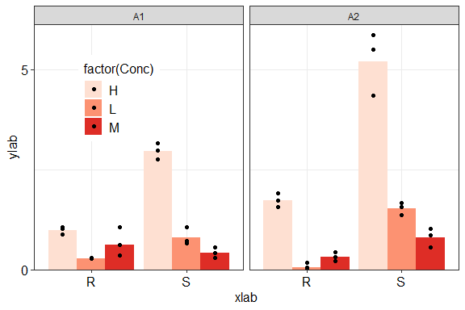
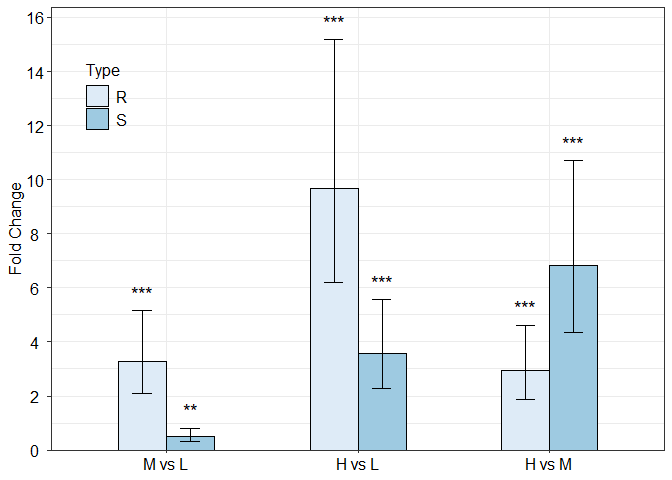
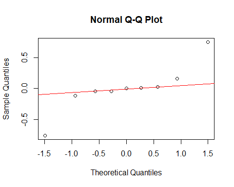

# Overview


Real-time polymerase chain reaction (real-time PCR) is widely used in biological studies. Various analysis methods are employed on the real-time PCR data to measure the mRNA levels under different experimental conditions. 
‘rtpcr’ package was developed for amplification efficiency calculation, statistical analysis and bar plot representation of real-time PCR data in R. By accounting for up to two reference genes and amplification efficiency values, a general calculation methodology described by <a href="https://doi.org/10.1186/s12859-017-1949-5">Ganger et al. (2017)</a>
and <a href="https://doi.org/10.1016/j.tibtech.2018.12.002">Taylor et al. (2019)</a>, matching both <a href="https://doi.org/10.1006/meth.2001.1262">Livak and Schmittgen (2001)</a> and <a href="https://doi.org/10.1093/nar/30.9.e36">Pfaffl et al. (2002) </a> methods  was used. Based on the experimental conditions, the functions of the ‘rtpcr’ package use t-test (for experiments with a two-level factor), analysis of variance, analysis of covariance (ANCOVA) or analysis of repeated measure data to calculate the fold change (FC, ${\Delta\Delta C_t}$ method) or relative expression (RE, ${\Delta C_t}$ method). The functions further provide standard errors and confidence interval for means, apply statistical mean comparisons and present significance. To facilitate function application, different data sets were used as examples and the outputs were explained. An outstanding feature of ‘rtpcr’ package is providing publication-ready bar plots with various controlling arguments for experiments with up to three different factors which are further editable by ggplot2 functions.

# Calculation methods
The basic method for expression estimation of a gene between conditions relies on the calculation of fold differences by applying the PCR amplification efficiency (E) and the threshold cycle (syn. crossing point or Ct). Among the various approaches developed for data analysis in real-time PCR, the Livak approach, also known as the $2^{-\Delta\Delta C_t}$ method, stands out for its simplicity and widespread use where the fold change (FC) exoression $(2^{-\Delta\Delta C_t})$ in Treatment (Tr) compared to Control (Co) condition is calculated according to equation:


$$\begin{align*}
\text{Fold change} & = 2^{-\Delta\Delta C_t} \\
& = \frac{2^{-(C_{t_{\text{target}}}-C_{t_{\text{ref}}})_{Tr}}}
{2^{-(C_{t_{\text{target}}}-C_{t_{\text{ref}}})_{Co}}} \\ 
& =2^{-[(C_{t_{\text{target}}}-C_{t_{\text{ref}}})_{\text{Tr}}-
{(C_{t_{\text{target}}}-C_{t_{\text{ref}}})}_{\text{Co}}]} \\ 
& = 2^{-[{(\Delta C_t)_{Tr} - (\Delta C_t)_{Co}}]}
\end{align*}$$


Here, $\Delta C_t$ is the difference between target Ct and reference Ct values for a given sample. Livak method assumes that both the target and reference genes are amplified with efficiencies close to 100%, allowing for the relative quantification of gene expression levels.

On the other hand, the Pfaffl method offers a more flexible approach by accounting for differences in amplification efficiencies between the target and reference genes. This method adjusts the calculated expression ratio by incorporating the specific amplification efficiencies, thus providing a more accurate representation of the relative gene expression levels.

$$\text{Fold change} = \frac{E^{-(C_{t_{\text{Tr}}}-C_{t_{\text{Co}}})_{target}}}
{E^{-(C_{t_{\text{Tr}}}-C_{t_{\text{Co}}})_{ref}}}$$

# A generalized calculation method
The `rtpcr` package was developed for the R environment in the major operating systems. The package functions are mainly based on the calculation of efficiency-weighted $\Delta C_t$ $(w\Delta C_t)$ values from target and reference gene Ct (equation 3). $w\Delta C_t$  values are weighted for the amplification efficiencies as described by Ganger et al. (2017) except that log2 is used instead of log10:


$$w\Delta Ct =\log_{2}(E_{target}).Ct_{target}-\log_{2}(E_{ref}).Ct_{ref}$$


The relative expression of the target gene normalized to that of reference gene(s) within the same sample or condition is called relative expression (RE). From the mean $w\Delta C_t$ values over biological replicates, RE of a target gene can be calculated for each condition according to the equation 

$$\text{Relative Expression} = 2^{-\overline{w\Delta Ct}}$$
Relative expression is only calibrated for the reference gene(s) and not for a control condition. However, often one condition is considered as calibrator and the fold change (FC) expression in other conditions is calculated relative to the calibrator. Examples are Treatment versus Control where Control is served as the calibrator, or time 0 versus time 1 (e.g. after 1 hour) and time 2 (e.g. after 2 hours) where time 0 is served as the reference or calibrator level. So, calibrator is the reference level or sample that all others are compared to. The fold change (FC) expression of a target gene for the reference or calibrator level is 1 because it is not changed compared to itself. The fold change expression of a target gene due to the treatment can be calculated as follows: 

$$\text{Fold Change due to Treatment}=2^{-(\overline{w\Delta Ct}_{\text{Tr}}-{\overline{w\Delta Ct}_{\text{Co}}})}$$

`qpcrTTEST` and `qpcrTTESTplot` functions calculate FC for multi-genes-two conditional cases, `qpcrANOVAFC` represents FC for single-gene-factorial (single- or multi-factor) experiments, and `qpcrREPEATED` calculates FC for the repeated measure data. If $w \Delta C_t$ values is calculated from the E values, the calculations match the formula of Pfaffl while if 2 (complete efficiency) be used instead, the result match the $2^{-\Delta\Delta C_t}$ method. In any case we called these as Fold Change in the outputs of `rtpcr`. Under factorial experiments where the calculation of the expression of the target gene relative to the reference gene (called Relative Expression) in each condition is desired, `qpcrANOVARE`, `oneFACTORplot`, `twoFACTORplot` and `threeFACTORplot` functions were developed for ANOVA analysis, and representing the plots from single, double or triple factor experiments, respectively. The last three functions generate `ggplot2`-derived graphs based on the output of the `qpcrANOVARE` function. If available, the blocking factor can also be handled by `qpcrANOVARE`, `qpcrANOVAFC` and `qpcrREPEATED` functions. Standard error of the FC and RE means is calculated according to <a href="https://doi.org/10.1016/j.tibtech.2018.12.002">Taylor et al. (2019)</a> in `rtpcr` package.
Here, a brief methodology is presented but details about the $w\Delta C_t$  calculations and statistical analysis are available in <a href="https://doi.org/10.1186/s12859-017-1949-5">Ganger et al. (2017)</a>. Importantly, because both the RE or FC gene expression values follow a lognormal distribution, a normal distribution is expected for the $w \Delta C_t$ values making it possible to apply t-test or analysis of variance to them. Following analysis, $w\Delta C_t$ values are statistically compared and standard deviations and confidence interval are calculated, but the transformation $y = 2^{-x}$ is applied in the final step in order to report the results.


# Installing and loading


The `rtpcr` package can be installed and loaded using:
```r
install.packages("rtpcr")
library(rtpcr)
```

Alternatively, the `rtpcr` with the latest changes can be installed by running the following code in your R software: 


```r
# install `rtpcr` from github (under development)

devtools::install_github("mirzaghaderi/rtpcr")

# I strongly recommend to install the package with the vignette as it contains information about how to use the 'rtpcr' package. Through the following code, Vignette is installed as well.

devtools::install_github("mirzaghaderi/rtpcr", build_vignettes = TRUE)
```


# Data structure and column arrangement

To use the functions, input data should be prepared in the right format with appropriate column arrangement. The correct column arrangement is shown in Table 1 and Table 2. For `qpcrANOVAFC` or `qpcrANOVARE` analysis, ensure that each line in the data set belongs to a separate individual or biological replicate reflecting a non-repeated measure experiment.

*Table 1. Data structure and column arrangement required for ‘rtpcr’ package.  rep: technical replicate; targetE and refE: amplification efficiency columns for target and reference genes, respectively. targetCt and refCt: target gene and reference gene Ct columns, respectively. factors (up to three factors is allowed): experimental factors.*

 | Experiment type     |  Column arrangement of the input data   | Example in the package                   |
 |:---------------------|:---------------------------------------|:------------------------------------------|
 |Amplification efficiency             |Dilutions - geneCt ... | data_efficiency |
 |t-test (accepts multiple genes)      |condition (put the control level first) - gene (put reference gene(s) last.)- efficiency - Ct  | data_ttest |
 |Factorial (Up to three factors)      |factor1 - rep - targetE - targetCt - refE - refCt | data_1factor |
 |                                     |factor1 - factor2 - rep - targetE - targetCt - refE - refCt | data_2factor |
 |                                     |factor1 - factor2 - factor3 - rep - targetE - targetCt - refE - refCt | data_3factor |
 |Factorial with blocking              |factor1 - block - rep - targetE - targetCt - refE - refCt | |
 |                                     |factor1 - factor2 - block - rep - targetE - targetCt - refE - refCt	 | data_2factorBlock |
 |                                     |factor1 - factor2 - factor3 - block - rep - targetE - targetCt - refE - refCt | |
 |Two reference genes                  |. . . . . .  rep - targetE - targetCt - ref1E - ref1Ct - ref2E - ref2Ct | |
 |calculating biological replicated    |. . . . . .  biologicalRep - techcicalRep - Etarget - targetCt - Eref - refCt  | data_withTechRep |
 |                |. . . . . .  biologicalRep - techcicalRep - Etarget - targetCt - ref1E - ref1Ct - ref2E - ref2Ct  | |
 

NOTE: For `qpcrANOVAFC` or `qpcrANOVARE` analysis, each line in the input data set belongs to a separate individual or biological replicate reflecting a non-repeated measure experiment.


*Table 2. Repeated measure data structure and column arrangement required for the `qpcrREPEATED` function.  targetE and refE: amplification efficiency columns for target and reference genes, respectively. targetCt and refCt: Ct columns for target and reference genes, respectively. In the "id" column, a unique number is assigned to each individual, e.g. all the three number 1 indicate a single individual.*

 | Experiment type      |  Column arrangement of the input data   | Example in the package                   |
 |:---------------------|:----------------------------------------|:------------------------------------------|
 |Repeated measure      | id - time - targetE - targetCt - ref1E - ref1Ct | data_repeated_measure_1 |
 |                      | id - time - targetE - targetCt - ref1E - ref1Ct - ref2E - ref2Ct | |
  |Repeated measure     | id - treatment - time - targetE - targetCt - ref1E - ref1Ct | data_repeated_measure_2 |
 |                      | id - treatment - time - targetE - targetCt - ref1E - ref1Ct - ref2E - ref2Ct | |


To see list of data in the `rtpcr` package run `data(package = "rtpcr")`. 
Example data sets can be presented by running the name of each data set. A description of the columns names in  each data set is called by "?" followed by the names of the data set, for example `?data_1factor`

# functions usage

To simplify `rtpcr` usage, examples for using the functions are presented below.


           
*Table 3. Functions and examples for using them.*

 | function             |                 Analysis | Example (see package help for more arguments) |
 |:---------------------|:-----------------------------------|:----------------------------------|
 | efficiency           | Efficiency, standard curves and related statistics | efficiency(data_efficiency) |
 | meanTech             | Calculating the mean of technical replicates | meanTech(data_withTechRep, groups = 1:4) |
 | qpcrANOVAFC          | FC and bar plot of the target gene (one or multi-factorial experiments) | qpcrANOVAFC(data_1factor, numberOfrefGenes = 1, mainFactor.column = 1, mainFactor.level.order = c("L1", "L2", "L3") |
 |  oneFACTORplot       | Bar plot of the relative gene expression from a one-factor experiment | out <- qpcrANOVARE(data_1factor, numberOfrefGenes = 1)\$Result;  oneFACTORplot(out, errorbar = "se") |
 |  qpcrANOVARE         | Analysis of Variance of the qpcr data  | qpcrANOVARE(data_3factor, numberOfrefGenes = 1) |
 | qpcrTTEST            | Computing the fold change and related statistics | qpcrTTEST(data_ttest,  numberOfrefGenes = 1, paired = FALSE, var.equal = TRUE) |
 | qpcrTTESTplot        | Bar plot of the average fold change of the target genes	 | qpcrTTESTplot(data_ttest,  numberOfrefGenes = 1, order = c("C2H2-01", "C2H2-12", "C2H2-26")) |
 |  threeFACTORplot     | Bar plot of the relative gene expression from a three-factor experiment | res <- qpcrANOVARE(data_3factor,  numberOfrefGenes = 1)\$Result; threeFACTORplot(res, 
 arrangement = c(3, 1, 2), errorbar = "se") |
 | twoFACTORplot        | Bar plot of the relative gene expression from a two-factor experiment | res <- qpcrANOVARE(data_2factor, numberOfrefGenes = 1)\$Result; twoFACTORplot(res, x.axis.factor = Genotype, group.factor = Drought, errorbar = "se") | 
 | qpcrREPEATED        | Bar plot of the fold change expression for repeated measure observations (taken over time from each individual) |  qpcrREPEATED(data_repeated_measure_2, numberOfrefGenes = 1), factor = "time" |
 

 
*see package help for more arguments including the number of reference genes, levels arrangement, blocking, and arguments for adjusting the bar plots.*
 

# Amplification efficiency data analysis
## Sample data of amplification efficiency

To calculate the amplification efficiencies of a target and a reference gene, a data frame should be prepared with 3 columns of dilutions, target gene Ct values, and reference gene Ct values, respectively,  as shown below.


```r
data_efficiency
```

```
##    dilutions  C2H2.26 C2H2.01    GAPDH
## 1       1.00 25.57823   24.25 22.60794
## 2       1.00 25.53636   24.13 22.68348
## 3       1.00 25.50280   24.04 22.62602
## 4       0.50 26.70615   25.56 23.67162
## 5       0.50 26.72720   25.43 23.64855
## 6       0.50 26.86921   26.01 23.70494
## 7       0.20 28.16874   27.37 25.11064
## 8       0.20 28.06759   26.94 25.11985
## 9       0.20 28.10531   27.14 25.10976
## 10      0.10 29.19743   28.05 26.16919
## 11      0.10 29.49406   28.89 26.15119
## 12      0.10 29.07117   28.32 26.15019
## 13      0.05 30.16878   29.50 27.11533
## 14      0.05 30.14193   29.93 27.13934
## 15      0.05 30.11671   29.71 27.16338
## 16      0.02 31.34969   30.69 28.52016
## 17      0.02 31.35254   30.54 28.57228
## 18      0.02 31.34804   30.04 28.53100
## 19      0.01 32.55013   31.12 29.49048
## 20      0.01 32.45329   31.29 29.48433
## 21      0.01 32.27515   31.15 29.26234
```


	


## Calculating amplification efficiency

Amplification efficiency in PCR can be either defined as percentage (from 0 to 1) or as time of PCR product increase per cycle (from 1 to 2).  in the `rtpcr` package, the amplification efficiency (E) has been referred to times of PCR product increase (1 to 2). A complete efficiency is equal to 2.  If dilutions and Ct values are available for a number of genes, the `efficiency` function calculates the amplification efficiency of genes and presents the related standard curves along with the Slope, Efficiency, and R2 statistics. The function also does pairwise comparisons of the slopes for the genes. For this, a regression line is fitted forst using the $\Delta C_t$ values of each pair of genes.


```r
efficiency(data_efficiency)
```

```
## $Efficiency
##      Gene     Slope        R2        E
## 1 C2H2.26 -3.388094 0.9965504 1.973110
## 2 C2H2.01 -3.528125 0.9713914 1.920599
## 3   GAPDH -3.414551 0.9990278 1.962747
## 
## $Slope_compare
## $emtrends
##  variable log10(dilutions).trend     SE df lower.CL upper.CL
##  C2H2.26                   -3.39 0.0856 57    -3.56    -3.22
##  C2H2.01                   -3.53 0.0856 57    -3.70    -3.36
##  GAPDH                     -3.41 0.0856 57    -3.59    -3.24
## 
## Confidence level used: 0.95 
## 
## $contrasts
##  contrast          estimate    SE df t.ratio p.value
##  C2H2.26 - C2H2.01   0.1400 0.121 57   1.157  0.4837
##  C2H2.26 - GAPDH     0.0265 0.121 57   0.219  0.9740
##  C2H2.01 - GAPDH    -0.1136 0.121 57  -0.938  0.6186
## 
## P value adjustment: tukey method for comparing a family of 3 estimates 
## 
## 
## $plot
```

<div class="figure" style="text-align: center">

<p class="caption">Standard curve and the amplification efficiency analysis of genes. Required iput data include dilutions and Ct value columns for different genes.</p>
</div>


Note: It is advised that the amplification efficiency be calculated for each cDNA sample because the amplification efficiency not only depends on the PCR mic and primer characteristics, but also varies among different cDNA samples.


# Expression data analysis

## Target genes in two conditions (t-test)

### Example data
When a target gene is assessed under two different conditions (for example Control and treatment), it is possible to calculate the average fold change expression $({\Delta \Delta C_t}$ method) of the target gene in treatment relative to control conditions. For this, the data should be prepared according to the following data set consisting of 4 columns belonging to condition levels, E (efficiency), genes and Ct values, respectively. Each Ct value is the mean of technical replicates. Complete amplification efficiencies of 2 have been assumed here for all wells but the calculated efficiencies can be used instead. 


```r
data_ttest
```

```
##    Condition    Gene E    Ct
## 1    control C2H2-26 2 31.26
## 2    control C2H2-26 2 31.01
## 3    control C2H2-26 2 30.97
## 4  treatment C2H2-26 2 32.65
## 5  treatment C2H2-26 2 32.03
## 6  treatment C2H2-26 2 32.40
## 7    control C2H2-01 2 31.06
## 8    control C2H2-01 2 30.41
## 9    control C2H2-01 2 30.97
## 10 treatment C2H2-01 2 28.85
## 11 treatment C2H2-01 2 28.93
## 12 treatment C2H2-01 2 28.90
## 13   control C2H2-12 2 28.50
## 14   control C2H2-12 2 28.40
## 15   control C2H2-12 2 28.80
## 16 treatment C2H2-12 2 27.90
## 17 treatment C2H2-12 2 28.00
## 18 treatment C2H2-12 2 27.90
## 19   control     ref 2 28.87
## 20   control     ref 2 28.42
## 21   control     ref 2 28.53
## 22 treatment     ref 2 28.31
## 23 treatment     ref 2 29.14
## 24 treatment     ref 2 28.63
```

### Data analysis under two conditions

Here, the above data set was used for the Fold Change expression analysis of the target genes using the `qpcrTTEST` function. This function performs a t-test-based analysis of any number of genes that have been evaluated under control and treatment conditions. The output is a table of target gene names, fold changes confidence limits, and the t.test derived p-values. The `qpcrTTEST` function includes the `var.equal` argument. When set to `FALSE`, `t.test` is performed under the unequal variances hypothesis. Furthermore, the samples in qPCR may be unpaired or paired so the analysis can be done for unpaired or paired conditions. Paired samples refer to a situation where the measurements are made on the same set of subjects or individuals. This could occur if the data is acquired from the same set of individuals before and after a treatment. In such cases, the paired t-test is used for statistical comparisons by setting the t-test `paired` argument to `TRUE`.


```r
qpcrTTEST(data_ttest, 
          numberOfrefGenes = 1,
          paired = F, 
          var.equal = T)
```

```
## $Raw_data
##    Var2  wDCt
## 1     1  2.39
## 2     1  2.59
## 3     1  2.44
## 4     1  4.34
## 5     1  2.89
## 6     1  3.77
## 7     2  2.19
## 8     2  1.99
## 9     2  2.44
## 10    2  0.54
## 11    2 -0.21
## 12    2  0.27
## 13    3 -0.37
## 14    3 -0.02
## 15    3  0.27
## 16    3 -0.41
## 17    3 -1.14
## 18    3 -0.73
## 
## $Result
##      Gene     dif     FC    LCL    UCL pvalue     se
## 1 C2H2-26  1.1933 0.4373 0.1926 0.9927 0.0488 0.4218
## 2 C2H2-01 -2.0067 4.0185 2.4598 6.5649 0.0014 0.2193
## 3 C2H2-12   -0.72 1.6472 0.9595 2.8279 0.0624 0.2113
```


### Generating plot
The `qpcrTTESTplot` function generates a bar plot of fold changes (FC) and confidence intervals for the target genes. the `qpcrTTESTplot` function accepts any number of genes and any replicates. The `qpcrTTESTplot` function automatically puts appropriate signs of **, * on top of the plot columns based on the output p-values.


```r
# Producing the plot
t1 <- qpcrTTESTplot(data_ttest,
              numberOfrefGenes = 1,
              fontsizePvalue = 4,
              errorbar = "ci")

# Producing the plot: specifying gene order
t2 <- qpcrTTESTplot(data_ttest,
              numberOfrefGenes = 1,
              order = c("C2H2-01", "C2H2-12", "C2H2-26"),
              paired = FALSE,
              var.equal = TRUE,
              width = 0.5,
              fill = "palegreen",
              y.axis.adjust = 3,
              y.axis.by = 2,
              ylab = "Average Fold Change",
              xlab = "none",
              fontsizePvalue = 4)

multiplot(t1, t2, cols = 2)
```

```
## $plot
## 
## $plot
```

```r
grid.text("A", x = 0.02, y = 1, just = c("right", "top"), gp=gpar(fontsize=16))
grid.text("B", x = 0.52, y = 1, just = c("right", "top"), gp=gpar(fontsize=16))
```

<div class="figure" style="text-align: center">

<p class="caption">Average Fold changes of three target genes relative to the control condition computed by unpaired t-tests via `qpcrTTESTplot` function. Confidence interval (ci) and standard error (se) has been used as error bar in 'A' and 'B', respectively.</p>
</div>

## Uni- or multi-factorial experiments: Fold Change (FC) analysis

In the rtpcr package, the fold change analysis of a target gene is applied based on analysis of variance; ANOVA (or analysis of covariance; ANCOVA) using the `qpcrANOVAFC` function. the default argument is `anova` but can be changes to `ancova` as well. the ancova analysis is suitable when the levels of a factor are also affected by an uncontrolled quantitative covariate. For example, suppose that wDCt of a target gene in a plant is affected by temperature. The gene may also be affected by drought. since we already know that temperature affects the target gene, we are interesting now if the gene expression is also altered by the drought levels. We can design an experiment to understand the gene behavior at both temperature and drought levels at the same time. The drought is another factor (the covariate) that may affect the expression of our gene under the levels of the first factor i.e. temperature. The data of such an experiment can be analyzed by both ANCOVA or factorial ANOVA using `qpcrANOVAFC` function. The function also works for one factor experiment as well. Bar plot of fold changes (FC values) along with the 95\% confidence interval is also returned by the `qpcrANOVAFC` function. There is also a function called `oneFACTORplot` which returns FC values and related plot for a one-factor-experiment with more than two levels. 


```r
# See sample data
data_2factor
```

```
##    Genotype Drought Rep EPO  POCt EGAPDH GAPDHCt
## 1         R      D0   1   2 33.30      2   31.53
## 2         R      D0   2   2 33.39      2   31.57
## 3         R      D0   3   2 33.34      2   31.50
## 4         R      D1   1   2 32.73      2   31.30
## 5         R      D1   2   2 32.46      2   32.55
## 6         R      D1   3   2 32.60      2   31.92
## 7         R      D2   1   2 33.48      2   33.30
## 8         R      D2   2   2 33.27      2   33.37
## 9         R      D2   3   2 33.32      2   33.35
## 10        S      D0   1   2 26.85      2   26.94
## 11        S      D0   2   2 28.17      2   27.69
## 12        S      D0   3   2 27.99      2   27.39
## 13        S      D1   1   2 30.41      2   28.70
## 14        S      D1   2   2 29.49      2   28.66
## 15        S      D1   3   2 29.98      2   28.71
## 16        S      D2   1   2 29.03      2   30.61
## 17        S      D2   2   2 28.73      2   30.20
## 18        S      D2   3   2 28.83      2   30.49
```

```r
order <- unique(data_2factor$Drought)
qpcrANOVAFC(data_2factor, 
           numberOfrefGenes = 1, 
           block = NULL,
           analysisType = "ancova",
           mainFactor.column = 2,
           mainFactor.level.order = order,
           fontsizePvalue = 4,
           x.axis.labels.rename = "none")
```

```
## ANOVA table 
## Type III Analysis of Variance Table with Satterthwaite's method
##                   Sum Sq Mean Sq NumDF  DenDF F value    Pr(>F)    
## Drought          12.9530  6.4765     2 9.9998  41.691 1.408e-05 ***
## Genotype          3.0505  3.0505     1 9.9998  19.637  0.001272 ** 
## Drought:Genotype  4.5454  2.2727     2 9.9998  14.630  0.001072 ** 
## ---
## Signif. codes:  0 '***' 0.001 '**' 0.01 '*' 0.05 '.' 0.1 ' ' 1
## 
## ANCOVA table
## Type III Analysis of Variance Table with Satterthwaite's method
##           Sum Sq Mean Sq NumDF DenDF F value    Pr(>F)    
## Genotype  3.0505  3.0505     1    14   6.649 0.0218703 *  
## Drought  12.9530  6.4765     2    14  14.117 0.0004398 ***
## ---
## Signif. codes:  0 '***' 0.001 '**' 0.01 '*' 0.05 '.' 0.1 ' ' 1
## 
## Fold Change table
##   contrast     FC pvalue sig    LCL    UCL     se
## 1       D0 1.0000 1.0000     0.0000 0.0000 0.3445
## 2 D1 vs D0 1.0705 0.8057     0.5194 2.2063 0.2631
## 3 D2 vs D0 3.5967 0.0005 *** 1.7452 7.4125 0.3576
## 
## Fold Change plot of the main factor levels
```

<div class="figure" style="text-align: center">

<p class="caption">Statistical table and figure of the Fold change expression of a gene in three different levels of Drough stress relative to the D0 as reference or calibrator level produced by the `qpcrANOVAFC` function. The other factor i.e. Genotype has been concidered as covariate.</p>
</div>


## Uni- or multi-factorial experiments: Relative Expression (RE) analysis

the `qpcrANOVARE` function performs Relative Expression (RE) analysis for uni- or multi-factorial experiments in which all factor level combinations are used as treatments. The input data set should be prepared as shown in table 1. Factor columns should be presented first followed by blocking factor (if available), biological replicates and efficiency and Ct values of target and reference gene(s). The example data set below (`data_3factor`) represents amplification efficiency and Ct values for target and reference genes under three grouping factors (two different cultivars, three drought levels, and the presence or absence of bacteria). Here, the efficiency value of 2 has been used for all wells, but the calculated efficiencies can be used instead.


```r
# See a sample dataset
data_3factor
```

```
##    Type Conc SA Replicate EPO  POCt EGAPDH GAPDHCt
## 1     R    L A1         1   2 33.30      2   31.53
## 2     R    L A1         2   2 33.39      2   31.57
## 3     R    L A1         3   2 33.34      2   31.50
## 4     R    L A2         1   2 34.01      2   31.48
## 5     R    L A2         2   2 36.82      2   31.44
## 6     R    L A2         3   2 35.44      2   31.46
## 7     R    M A1         1   2 32.73      2   31.30
## 8     R    M A1         2   2 32.46      2   32.55
## 9     R    M A1         3   2 32.60      2   31.92
## 10    R    M A2         1   2 33.37      2   31.19
## 11    R    M A2         2   2 33.12      2   31.94
## 12    R    M A2         3   2 33.21      2   31.57
## 13    R    H A1         1   2 33.48      2   33.30
## 14    R    H A1         2   2 33.27      2   33.37
## 15    R    H A1         3   2 33.32      2   33.35
## 16    R    H A2         1   2 32.53      2   33.47
## 17    R    H A2         2   2 32.61      2   33.26
## 18    R    H A2         3   2 32.56      2   33.36
## 19    S    L A1         1   2 26.85      2   26.94
## 20    S    L A1         2   2 28.17      2   27.69
## 21    S    L A1         3   2 27.99      2   27.39
## 22    S    L A2         1   2 28.71      2   29.45
## 23    S    L A2         2   2 29.01      2   29.46
## 24    S    L A2         3   2 28.82      2   29.48
## 25    S    M A1         1   2 30.41      2   28.70
## 26    S    M A1         2   2 29.49      2   28.66
## 27    S    M A1         3   2 29.98      2   28.71
## 28    S    M A2         1   2 28.91      2   28.09
## 29    S    M A2         2   2 28.60      2   28.65
## 30    S    M A2         3   2 28.59      2   28.37
## 31    S    H A1         1   2 29.03      2   30.61
## 32    S    H A1         2   2 28.73      2   30.20
## 33    S    H A1         3   2 28.83      2   30.49
## 34    S    H A2         1   2 28.29      2   30.84
## 35    S    H A2         2   2 28.53      2   30.65
## 36    S    H A2         3   2 28.28      2   30.74
```


### Output table of the analysis

The `qpcrANOVARE` function produces the main analysis output including mean wDCt, LCL, UCL, grouping letters, and standard deviations for relative expression values. The standard deviation for each treatment is derived from the biological replicates of back-transformed wDCt data.


```r
# If the data include technical replicates, means of technical replicates
# should be calculated first using meanTech function.

# Applying ANOVA analysis
res <- qpcrANOVARE(data_2factor,
                   numberOfrefGenes = 1,
                   block = NULL)
```

```
## Analysis of Variance Table
## 
## Response: wDCt
##           Df  Sum Sq Mean Sq F value    Pr(>F)    
## T          5 20.5489  4.1098  26.267 4.515e-06 ***
## Residuals 12  1.8775  0.1565                      
## ---
## Signif. codes:  0 '***' 0.001 '**' 0.01 '*' 0.05 '.' 0.1 ' ' 1
## 
## Relative expression table
##   Genotype Drought     RE    LCL    UCL         se letters
## 1        S      D2 2.9690 2.1030 4.1918 0.05507571    a   
## 2        R      D2 0.9885 0.7002 1.3956 0.08412953     b  
## 3        S      D0 0.7955 0.5635 1.1232 0.21283797     b  
## 4        R      D1 0.6271 0.4441 0.8853 0.43879887     bc 
## 5        S      D1 0.4147 0.2937 0.5854 0.25403412      cd
## 6        R      D0 0.2852 0.2020 0.4026 0.02081666       d
```

```r
res$Result
```

```
##   Genotype Drought     RE    LCL    UCL         se letters
## 1        S      D2 2.9690 2.1030 4.1918 0.05507571    a   
## 2        R      D2 0.9885 0.7002 1.3956 0.08412953     b  
## 3        S      D0 0.7955 0.5635 1.1232 0.21283797     b  
## 4        R      D1 0.6271 0.4441 0.8853 0.43879887     bc 
## 5        S      D1 0.4147 0.2937 0.5854 0.25403412      cd
## 6        R      D0 0.2852 0.2020 0.4026 0.02081666       d
```

```r
res$Post_hoc_Test
```

```
## NULL
```


```r
# Before plotting, the result needs to be extracted as below:
out2 <- qpcrANOVARE(data_1factor, numberOfrefGenes = 1, block = NULL)$Result
```

```
## Analysis of Variance Table
## 
## Response: wDCt
##           Df Sum Sq Mean Sq F value   Pr(>F)   
## T          2 4.9393 2.46963  12.345 0.007473 **
## Residuals  6 1.2003 0.20006                    
## ---
## Signif. codes:  0 '***' 0.001 '**' 0.01 '*' 0.05 '.' 0.1 ' ' 1
## 
## Relative expression table
##   SA     RE    LCL    UCL         se letters
## 1 L3 0.9885 0.6379 1.5318 0.08412953      a 
## 2 L2 0.6271 0.4047 0.9717 0.43879887      a 
## 3 L1 0.2852 0.1840 0.4419 0.02081666       b
```

```r
f1 <- oneFACTORplot(out2,
              width = 0.2,
              fill = "skyblue",
              y.axis.adjust = 0.5,
              y.axis.by = 1,
              errorbar = "ci",
              show.letters = TRUE,
              letter.position.adjust = 0.1,
              ylab = "Relative Expression",
              xlab = "Factor Levels",
              fontsize = 12,
              fontsizePvalue = 4)


addline_format <- function(x,...){
    gsub('\\s','\n',x)
}
order <- unique(data_2factor$Drought)
f2 <- qpcrANOVAFC(data_1factor,
                 numberOfrefGenes = 1,
                 mainFactor.column = 1,
                 block = NULL,
                 mainFactor.level.order = c("L1","L2","L3"),
                 width = 0.5,
                 fill = c("skyblue","#79CDCD"),
                 y.axis.by = 1,
                 letter.position.adjust = 0,
                 y.axis.adjust = 1,
                 ylab = "Fold Change",
                 fontsize = 12, plot = F,
                 x.axis.labels.rename = addline_format(c("Control", 
                                                       "Treatment_1 vs Control", 
                                                       "Treatment_2 vs Control")))
```

```
## ANOVA table 
## Type III Analysis of Variance Table with Satterthwaite's method
##    Sum Sq Mean Sq NumDF DenDF F value  Pr(>F)  
## SA 4.9393  2.4696     2     4  14.319 0.01502 *
## ---
## Signif. codes:  0 '***' 0.001 '**' 0.01 '*' 0.05 '.' 0.1 ' ' 1
## 
## ANCOVA table
## Type III Analysis of Variance Table with Satterthwaite's method
##    Sum Sq Mean Sq NumDF DenDF F value  Pr(>F)  
## SA 4.9393  2.4696     2     4  14.319 0.01502 *
## ---
## Signif. codes:  0 '***' 0.001 '**' 0.01 '*' 0.05 '.' 0.1 ' ' 1
## 
## Fold Change table
##                   contrast     FC pvalue sig    LCL    UCL     se
## 1                  Control 1.0000 1.0000     0.0000 0.0000 0.0208
## 2 Treatment_1\nvs\nControl 2.1987 0.0285   * 0.9514 5.0812 0.4388
## 3 Treatment_2\nvs\nControl 3.4661 0.0061  ** 1.4999 8.0101 0.0841
```

```r
multiplot(f1, f2$FC_Plot_of_the_main_factor_levels, cols = 2)
grid.text("A", x = 0.02, y = 1, just = c("right", "top"), gp=gpar(fontsize=16))
grid.text("B", x = 0.52, y = 1, just = c("right", "top"), gp=gpar(fontsize=16))
```

<div class="figure" style="text-align: center">

<p class="caption">A: bar plot representing Relative expression of a gene under three levels of a factor generated using `oneFACTORplot` function, B: Plot of the Fold change expression produced by the `qpcrANOVAFC` function from the same data used for 'A'. The first element in the `mainFactor.level.order` argument (here L1) is served as the Reference level, although the x-axis names have later been renamed by the `x.axis.labels.rename` argument. Error bars represent 95% confidence interval in A and standard error in B.</p>
</div>


### Barplot with the (1-alpha)% confidence interval as error bars


```r
# Before plotting, the result needs to be extracted as below:
res <- qpcrANOVARE(data_2factor, numberOfrefGenes = 1, block = NULL)$Result
```

```
## Analysis of Variance Table
## 
## Response: wDCt
##           Df  Sum Sq Mean Sq F value    Pr(>F)    
## T          5 20.5489  4.1098  26.267 4.515e-06 ***
## Residuals 12  1.8775  0.1565                      
## ---
## Signif. codes:  0 '***' 0.001 '**' 0.01 '*' 0.05 '.' 0.1 ' ' 1
## 
## Relative expression table
##   Genotype Drought     RE    LCL    UCL         se letters
## 1        S      D2 2.9690 2.1030 4.1918 0.05507571    a   
## 2        R      D2 0.9885 0.7002 1.3956 0.08412953     b  
## 3        S      D0 0.7955 0.5635 1.1232 0.21283797     b  
## 4        R      D1 0.6271 0.4441 0.8853 0.43879887     bc 
## 5        S      D1 0.4147 0.2937 0.5854 0.25403412      cd
## 6        R      D0 0.2852 0.2020 0.4026 0.02081666       d
```

```r
Final_data <- qpcrANOVARE(data_2factor, numberOfrefGenes = 1, block = NULL)$Final_data
```

```
## Analysis of Variance Table
## 
## Response: wDCt
##           Df  Sum Sq Mean Sq F value    Pr(>F)    
## T          5 20.5489  4.1098  26.267 4.515e-06 ***
## Residuals 12  1.8775  0.1565                      
## ---
## Signif. codes:  0 '***' 0.001 '**' 0.01 '*' 0.05 '.' 0.1 ' ' 1
## 
## Relative expression table
##   Genotype Drought     RE    LCL    UCL         se letters
## 1        S      D2 2.9690 2.1030 4.1918 0.05507571    a   
## 2        R      D2 0.9885 0.7002 1.3956 0.08412953     b  
## 3        S      D0 0.7955 0.5635 1.1232 0.21283797     b  
## 4        R      D1 0.6271 0.4441 0.8853 0.43879887     bc 
## 5        S      D1 0.4147 0.2937 0.5854 0.25403412      cd
## 6        R      D0 0.2852 0.2020 0.4026 0.02081666       d
```

```r
# Plot of the 'res' data with 'Genotype' as grouping factor
q1 <- twoFACTORplot(res,
   x.axis.factor = Drought,
   group.factor = Genotype,
   errorbar = "se",
   width = 0.5,
   fill = "Greens",
   y.axis.adjust = 0.5,
   y.axis.by = 2,
   ylab = "Relative Expression",
   xlab = "Drought Levels",
   legend.position = c(0.15, 0.8),
   show.letters = TRUE,
   fontsizePvalue = 4)

# Plotting the same data with 'Drought' as grouping factor
q2 <- twoFACTORplot(res,
   x.axis.factor = Genotype,
   group.factor = Drought,
   errorbar = "se",
   xlab = "Genotype",
   fill = "Blues",
   legend.position = c(0.15, 0.8),
   show.letters = FALSE,
   show.errorbars = T,
   fontsizePvalue = 4)

multiplot(q1, q2, cols = 2)
grid.text("A", x = 0.02, y = 1, just = c("right", "top"), gp=gpar(fontsize=16))
grid.text("B", x = 0.52, y = 1, just = c("right", "top"), gp=gpar(fontsize=16))
```

<div class="figure" style="text-align: center">

<p class="caption">Relative expression of a target gene under two different factors of genotype (with two levels) and drought (with three levels). Error bars represent standard error. Means (columns) lacking letters in common have significant difference at alpha = 0.05 as resulted from a `LSD.test`.</p>
</div>


### A three-factorial experiment example


```r
# Before plotting, the result needs to be extracted as below:
res <- qpcrANOVARE(data_3factor, numberOfrefGenes = 1, block = NULL)$Result
```

```
## Analysis of Variance Table
## 
## Response: wDCt
##           Df Sum Sq Mean Sq F value    Pr(>F)    
## T         11 94.001  8.5456  29.188 3.248e-11 ***
## Residuals 24  7.027  0.2928                      
## ---
## Signif. codes:  0 '***' 0.001 '**' 0.01 '*' 0.05 '.' 0.1 ' ' 1
## 
## Relative expression table
##    Type Conc SA     RE    LCL    UCL         se  letters
## 1     S    H A2 5.1934 3.3217 8.1197 0.13093680  a      
## 2     S    H A1 2.9690 1.8990 4.6420 0.05507571  ab     
## 3     R    H A2 1.7371 1.1110 2.7159 0.08373238   bc    
## 4     S    L A2 1.5333 0.9807 2.3973 0.08647415    c    
## 5     R    H A1 0.9885 0.6323 1.5455 0.08412953    cd   
## 6     S    L A1 0.7955 0.5088 1.2438 0.21283797     d   
## 7     S    M A2 0.7955 0.5088 1.2438 0.25709920     d   
## 8     R    M A1 0.6271 0.4011 0.9804 0.43879887     de  
## 9     S    M A1 0.4147 0.2652 0.6483 0.25403412      ef 
## 10    R    M A2 0.3150 0.2015 0.4925 0.28898289       f 
## 11    R    L A1 0.2852 0.1824 0.4459 0.02081666       f 
## 12    R    L A2 0.0641 0.0410 0.1002 0.82276634        g
```

```r
res
```

```
##    Type Conc SA     RE    LCL    UCL         se  letters
## 1     S    H A2 5.1934 3.3217 8.1197 0.13093680  a      
## 2     S    H A1 2.9690 1.8990 4.6420 0.05507571  ab     
## 3     R    H A2 1.7371 1.1110 2.7159 0.08373238   bc    
## 4     S    L A2 1.5333 0.9807 2.3973 0.08647415    c    
## 5     R    H A1 0.9885 0.6323 1.5455 0.08412953    cd   
## 6     S    L A1 0.7955 0.5088 1.2438 0.21283797     d   
## 7     S    M A2 0.7955 0.5088 1.2438 0.25709920     d   
## 8     R    M A1 0.6271 0.4011 0.9804 0.43879887     de  
## 9     S    M A1 0.4147 0.2652 0.6483 0.25403412      ef 
## 10    R    M A2 0.3150 0.2015 0.4925 0.28898289       f 
## 11    R    L A1 0.2852 0.1824 0.4459 0.02081666       f 
## 12    R    L A2 0.0641 0.0410 0.1002 0.82276634        g
```

```r
# releveling a factor levels first
res$Conc <- factor(res$Conc, levels = c("L","M","H"))
res$Type <- factor(res$Type, levels = c("S","R"))

# Arrange the first three colunms of the result table.
# This determines the columns order and shapes the plot output.
p1 <- threeFACTORplot(res,
    arrangement = c(3, 1, 2),
    errorbar = "se",
    legend.position = c(0.2, 0.85),
    xlab = "condition",
    fontsizePvalue = 4)


# When using ci as error, increase y.axis.adjust to see the plot correctly!
p2 <- threeFACTORplot(res,
   arrangement = c(2, 3, 1),
   bar.width = 0.8,
   fill = "Greens",
   xlab = "Drought",
   ylab = "Relative Expression",
   errorbar = "ci",
   y.axis.adjust = 2,
   y.axis.by = 2,
   letter.position.adjust = 0.6,
   legend.title = "Genotype",
   fontsize = 12,
   legend.position = c(0.2, 0.8),
   show.letters = TRUE,
   fontsizePvalue = 4)

multiplot(p1, p2, cols = 2)
grid.text("A", x = 0.02, y = 1, just = c("right", "top"), gp=gpar(fontsize=16))
grid.text("B", x = 0.52, y = 1, just = c("right", "top"), gp=gpar(fontsize=16))
```

<div class="figure" style="text-align: center">

<p class="caption">A and B) Relative expression (RE) of a target gene from a three-factorial experiment data produced by  `threeFACTORplot`  function. Error bars represent standard error (A), although can be set to confidence interval (B). Means (columns) lacking letters in common have significant differences at alpha = 0.05 as resulted from an ‘LSD.test’.</p>
</div>


## Repeated measure data in qpcr

Fold change (FC) analysis of observations repeatedly taken over time `qpcrREPEATED` function, for Repeated measure analysis of uni- or multi-factorial experiment data. The bar plot of the fold changes (FC) values along with the standard error (se) or confidence interval (ci) is also returned by the `qpcrREPEATED` function.


```r
a <- qpcrREPEATED(data_repeated_measure_1,
                  numberOfrefGenes = 1,
                  block = NULL,
                  fill = c("#778899", "#BCD2EE"),
                  factor = "time",
                  axis.text.x.angle = 45,
                  axis.text.x.hjust = 1,
                  plot = F)
```

```
## Warning in qpcrREPEATED(data_repeated_measure_1, numberOfrefGenes = 1, block =
## NULL, : The level 1 of the selected factor was used as calibrator.
```

```
## Type III Analysis of Variance Table with Satterthwaite's method
##      Sum Sq Mean Sq NumDF DenDF F value  Pr(>F)  
## time 11.073  5.5364     2     4  4.5382 0.09357 .
## ---
## Signif. codes:  0 '***' 0.001 '**' 0.01 '*' 0.05 '.' 0.1 ' ' 1
## 
## Fold Change table
##         contrast     FC pvalue sig    LCL     UCL     se
## 1          time1 1.0000 1.0000     0.0000  0.0000 1.4051
## 2 time2 vs time1 0.8566 0.8166     0.0923  7.9492 0.9753
## 3 time3 vs time1 4.7022 0.0685   . 0.5067 43.6368 0.5541
```

```r
b <- qpcrREPEATED(data_repeated_measure_2,
                  numberOfrefGenes = 1,
                  factor = "time",
                  block = NULL,
                  axis.text.x.angle = 45,
                  axis.text.x.hjust = 1,
                  plot = F)
```

```
## Warning in qpcrREPEATED(data_repeated_measure_2, numberOfrefGenes = 1, factor =
## "time", : The level 1 of the selected factor was used as calibrator.
```

```
## NOTE: Results may be misleading due to involvement in interactions
```

```
## Type III Analysis of Variance Table with Satterthwaite's method
##                Sum Sq Mean Sq NumDF DenDF F value  Pr(>F)  
## time           5.9166 2.95832     2     8  3.4888 0.08139 .
## treatment      0.6773 0.67728     1     4  0.7987 0.42199  
## time:treatment 6.3186 3.15932     2     8  3.7258 0.07186 .
## ---
## Signif. codes:  0 '***' 0.001 '**' 0.01 '*' 0.05 '.' 0.1 ' ' 1
## 
## Fold Change table
##         contrast     FC pvalue sig    LCL    UCL     se
## 1          time1 1.0000 1.0000     0.0000 0.0000 0.7036
## 2 time2 vs time1 1.2556 0.5540     0.4381 3.5987 0.5323
## 3 time3 vs time1 2.5432 0.0351   * 0.8873 7.2895 0.7074
```

```r
multiplot(a, b, cols = 2)
```

<div class="figure" style="text-align: center">

<p class="caption">Fold change expression (FC) of a target gene from a one and a two factorial experiment data produced by  `qpcrREPEATED`  function. Error bars represent standard error (A), although can be set to confidence interval.</p>
</div>

```
## $Final_data
##   id time Etarget Cttarget Eref Ctref   wDCt
## 1  1    1       2    18.92    2 32.77 -13.85
## 2  1    2       2    19.46    2 33.03 -13.57
## 3  1    3       2    15.73    2 32.95 -17.22
## 4  2    1       2    15.82    2 32.45 -16.63
## 5  2    2       2    17.56    2 33.24 -15.68
## 6  2    3       2    17.21    2 33.64 -16.43
## 7  3    1       2    19.84    2 31.62 -11.78
## 8  3    2       2    19.74    2 32.08 -12.34
## 9  3    3       2    18.09    2 33.40 -15.31
## 
## $lm
## Linear mixed model fit by REML ['lmerModLmerTest']
## Formula: formula
##    Data: x
## REML criterion at convergence: 25.0824
## Random effects:
##  Groups   Name        Std.Dev.
##  id       (Intercept) 1.419   
##  Residual             1.105   
## Number of obs: 9, groups:  id, 3
## Fixed Effects:
## (Intercept)        time2        time3  
##    -14.0867       0.2233      -2.2333  
## 
## $ANOVA_table
## Type III Analysis of Variance Table with Satterthwaite's method
##      Sum Sq Mean Sq NumDF DenDF F value  Pr(>F)  
## time 11.073  5.5364     2     4  4.5382 0.09357 .
## ---
## Signif. codes:  0 '***' 0.001 '**' 0.01 '*' 0.05 '.' 0.1 ' ' 1
## 
## $FC_statistics_of_the_main_factor
##         contrast     FC pvalue sig    LCL     UCL     se
## 1          time1 1.0000 1.0000     0.0000  0.0000 1.4051
## 2 time2 vs time1 0.8566 0.8166     0.0923  7.9492 0.9753
## 3 time3 vs time1 4.7022 0.0685   . 0.5067 43.6368 0.5541
## 
## $FC_Plot
## 
## attr(,"class")
## [1] "XX"
## $Final_data
##    id treatment time Etarget Cttarget Eref Ctref   wDCt
## 1   1 untreated    1       2    19.24    2 33.73 -14.49
## 2   1 untreated    2       2    19.95    2 34.20 -14.25
## 3   1 untreated    3       2    19.16    2 33.90 -14.74
## 4   2 untreated    1       2    20.11    2 32.56 -12.45
## 5   2 untreated    2       2    20.91    2 33.98 -13.07
## 6   2 untreated    3       2    20.91    2 33.16 -12.25
## 7   3 untreated    1       2    20.63    2 33.72 -13.09
## 8   3 untreated    2       2    19.16    2 34.51 -15.35
## 9   3 untreated    3       2    19.91    2 34.33 -14.42
## 10  4   treated    1       2    18.92    2 32.77 -13.85
## 11  4   treated    2       2    19.46    2 33.03 -13.57
## 12  4   treated    3       2    15.73    2 32.95 -17.22
## 13  5   treated    1       2    15.82    2 32.45 -16.63
## 14  5   treated    2       2    17.56    2 33.24 -15.68
## 15  5   treated    3       2    17.21    2 33.64 -16.43
## 16  6   treated    1       2    19.84    2 31.62 -11.78
## 17  6   treated    2       2    19.74    2 32.08 -12.34
## 18  6   treated    3       2    18.09    2 33.40 -15.31
## 
## $lm
## Linear mixed model fit by REML ['lmerModLmerTest']
## Formula: formula
##    Data: x
## REML criterion at convergence: 45.9708
## Random effects:
##  Groups   Name        Std.Dev.
##  id       (Intercept) 1.2134  
##  Residual             0.9208  
## Number of obs: 18, groups:  id, 6
## Fixed Effects:
##            (Intercept)                   time2                   time3  
##               -13.3433                 -0.8800                 -0.4600  
##       treatmenttreated  time2:treatmenttreated  time3:treatmenttreated  
##                -0.7433                  1.1033                 -1.7733  
## 
## $ANOVA_table
## Type III Analysis of Variance Table with Satterthwaite's method
##                Sum Sq Mean Sq NumDF DenDF F value  Pr(>F)  
## time           5.9166 2.95832     2     8  3.4888 0.08139 .
## treatment      0.6773 0.67728     1     4  0.7987 0.42199  
## time:treatment 6.3186 3.15932     2     8  3.7258 0.07186 .
## ---
## Signif. codes:  0 '***' 0.001 '**' 0.01 '*' 0.05 '.' 0.1 ' ' 1
## 
## $FC_statistics_of_the_main_factor
##         contrast     FC pvalue sig    LCL    UCL     se
## 1          time1 1.0000 1.0000     0.0000 0.0000 0.7036
## 2 time2 vs time1 1.2556 0.5540     0.4381 3.5987 0.5323
## 3 time3 vs time1 2.5432 0.0351   * 0.8873 7.2895 0.7074
## 
## $FC_Plot
## 
## attr(,"class")
## [1] "XX"
```


## Fold change analysis using a model

The `qpcrMeans` performs fold change ${\Delta \Delta C_t}$ mwthid analysis using a model produced by the
`qpcrANOVAFC` or `qpcrREPEATED.` The values can be returned for any effects in the model including simple effects,
interactions and slicing if an ANOVA model is used, but ANCOVA models returned by rtpcr package only include simple effects.


```r
# Returning fold change values from a fitted model.
# Firstly, result of `qpcrANOVAFC` or `qpcrREPEATED` is 
# acquired which includes a model object:
res <- qpcrANOVAFC(data_3factor, numberOfrefGenes = 1, mainFactor.column = 1, block = NULL)
```

```
## Warning in qpcrANOVAFC(data_3factor, numberOfrefGenes = 1, mainFactor.column =
## 1, : The R level was used as calibrator.
```

```
## NOTE: Results may be misleading due to involvement in interactions
```

```
## ANOVA table 
## Type III Analysis of Variance Table with Satterthwaite's method
##              Sum Sq Mean Sq NumDF DenDF F value    Pr(>F)    
## Type         24.834 24.8336     1    24 84.8207 2.392e-09 ***
## Conc         45.454 22.7269     2    24 77.6252 3.319e-11 ***
## SA            0.032  0.0324     1    24  0.1107 0.7422788    
## Type:Conc    10.641  5.3203     2    24 18.1718 1.567e-05 ***
## Type:SA       6.317  6.3168     1    24 21.5756 0.0001024 ***
## Conc:SA       3.030  1.5150     2    24  5.1747 0.0135366 *  
## Type:Conc:SA  3.694  1.8470     2    24  6.3086 0.0062852 ** 
## ---
## Signif. codes:  0 '***' 0.001 '**' 0.01 '*' 0.05 '.' 0.1 ' ' 1
## 
## ANCOVA table
## Type III Analysis of Variance Table with Satterthwaite's method
##      Sum Sq Mean Sq NumDF DenDF F value    Pr(>F)    
## SA    0.032  0.0324     1    31  0.0327    0.8577    
## Conc 45.454 22.7269     2    31 22.9429 7.682e-07 ***
## Type 24.834 24.8336     1    31 25.0696 2.105e-05 ***
## ---
## Signif. codes:  0 '***' 0.001 '**' 0.01 '*' 0.05 '.' 0.1 ' ' 1
## 
## Fold Change table
##   contrast     FC pvalue sig    LCL    UCL     se
## 1        R 1.0000      1     0.0000 0.0000 0.3939
## 2   S vs R 3.1626      0 *** 2.4403 4.0987 0.3064
## 
## Fold Change plot of the main factor levels
```

<!-- -->

```r
# Returning fold change values of Conc levels from a fitted model:
qpcrMeans(res$lm_ANOVA, specs = "Conc")
```

```
##  contrast       FC        SE df      LCL      UCL p.value sig
##  M vs L   1.307369 0.2208988 22 0.951681 1.795994  0.0940 .  
##  H vs L   5.869889 0.2208988 22 4.272905 8.063742  <.0001 ***
##  H vs M   4.489848 0.2208988 22 3.268323 6.167915  <.0001 ***
## 
## Results are averaged over the levels of: Type, SA 
## Degrees-of-freedom method: kenward-roger 
## Confidence level used: 0.95
```

```r
# Returning fold change values of Conc levels sliced by Type*SA:
qpcrMeans(res$lm_ANOVA, specs = "Conc | (Type*SA)")
```

```
## Type = R, SA = A1:
##  contrast        FC        SE df       LCL      UCL p.value sig
##  M vs L    2.198724 0.4417977 22  1.165084  4.14939  0.0174 *  
##  H vs L    3.466148 0.4417977 22  1.836681  6.54125  0.0005 ***
##  H vs M    1.576436 0.4417977 22  0.835339  2.97502  0.1514    
## 
## Type = S, SA = A1:
##  contrast        FC        SE df       LCL      UCL p.value sig
##  M vs L    0.521233 0.4417977 22  0.276197  0.98366  0.0448 *  
##  H vs L    3.732132 0.4417977 22  1.977623  7.04321  0.0003 ***
##  H vs M    7.160201 0.4417977 22  3.794126 13.51259  <.0001 ***
## 
## Type = R, SA = A2:
##  contrast        FC        SE df       LCL      UCL p.value sig
##  M vs L    4.913213 0.4417977 22  2.603467  9.27212  <.0001 ***
##  H vs L   27.095850 0.4417977 22 14.357849 51.13476  <.0001 ***
##  H vs M    5.514895 0.4417977 22  2.922293 10.40760  <.0001 ***
## 
## Type = S, SA = A2:
##  contrast        FC        SE df       LCL      UCL p.value sig
##  M vs L    0.518830 0.4417977 22  0.274923  0.97913  0.0434 *  
##  H vs L    3.386981 0.4417977 22  1.794731  6.39184  0.0006 ***
##  H vs M    6.528116 0.4417977 22  3.459190 12.31973  <.0001 ***
## 
## Degrees-of-freedom method: kenward-roger 
## Confidence level used: 0.95
```

```r
# Returning fold change values of Conc
qpcrMeans(res$lm_ANOVA, specs = "Conc * Type")
```

```
##  contrast          FC        SE df       LCL      UCL p.value sig
##  M R vs L R  3.286761 0.3123981 22  2.097677  5.14989  <.0001 ***
##  H R vs L R  9.691142 0.3123981 22  6.185081 15.18464  <.0001 ***
##  L S vs L R  8.168097 0.3123981 22  5.213044 12.79824  <.0001 ***
##  M S vs L R  4.247655 0.3123981 22  2.710939  6.65547  <.0001 ***
##  H S vs L R 29.040613 0.3123981 22 18.534303 45.50251  <.0001 ***
##  H R vs M R  2.948538 0.3123981 22  1.881816  4.61994  0.0001 ***
##  L S vs M R  2.485151 0.3123981 22  1.586073  3.89388  0.0004 ***
##  M S vs M R  1.292353 0.3123981 22  0.824806  2.02493  0.2489    
##  H S vs M R  8.835632 0.3123981 22  5.639078 13.84418  <.0001 ***
##  L S vs H R  0.842842 0.3123981 22  0.537918  1.32061  0.4382    
##  M S vs H R  0.438303 0.3123981 22  0.279734  0.68676  0.0010 ***
##  H S vs H R  2.996614 0.3123981 22  1.912499  4.69527  <.0001 ***
##  M S vs L S  0.520030 0.3123981 22  0.331894  0.81481  0.0063 ** 
##  H S vs L S  3.555371 0.3123981 22  2.269109  5.57076  <.0001 ***
##  H S vs M S  6.836857 0.3123981 22  4.363420 10.71238  <.0001 ***
## 
## Results are averaged over the levels of: SA 
## Degrees-of-freedom method: kenward-roger 
## Confidence level used: 0.95
```

```r
# Returning fold change values of Conc levels sliced by Type:
res2 <- qpcrMeans(res$lm_ANOVA, specs = "Conc | Type")
twoFACTORplot(res2, x.axis.factor = contrast, ylab = "Fold Change",
              group.factor = Type, errorbar = "ci")
```

<!-- -->


# An example of showing point on the plot

```r
library(ggplot2)
b <- qpcrANOVARE(data_3factor, numberOfrefGenes = 1, block = NULL)$Result
```

```
## Analysis of Variance Table
## 
## Response: wDCt
##           Df Sum Sq Mean Sq F value    Pr(>F)    
## T         11 94.001  8.5456  29.188 3.248e-11 ***
## Residuals 24  7.027  0.2928                      
## ---
## Signif. codes:  0 '***' 0.001 '**' 0.01 '*' 0.05 '.' 0.1 ' ' 1
## 
## Relative expression table
##    Type Conc SA     RE    LCL    UCL         se  letters
## 1     S    H A2 5.1934 3.3217 8.1197 0.13093680  a      
## 2     S    H A1 2.9690 1.8990 4.6420 0.05507571  ab     
## 3     R    H A2 1.7371 1.1110 2.7159 0.08373238   bc    
## 4     S    L A2 1.5333 0.9807 2.3973 0.08647415    c    
## 5     R    H A1 0.9885 0.6323 1.5455 0.08412953    cd   
## 6     S    L A1 0.7955 0.5088 1.2438 0.21283797     d   
## 7     S    M A2 0.7955 0.5088 1.2438 0.25709920     d   
## 8     R    M A1 0.6271 0.4011 0.9804 0.43879887     de  
## 9     S    M A1 0.4147 0.2652 0.6483 0.25403412      ef 
## 10    R    M A2 0.3150 0.2015 0.4925 0.28898289       f 
## 11    R    L A1 0.2852 0.1824 0.4459 0.02081666       f 
## 12    R    L A2 0.0641 0.0410 0.1002 0.82276634        g
```

```r
a <- qpcrANOVARE(data_3factor, numberOfrefGenes = 1, block = NULL)$Final_data
```

```
## Analysis of Variance Table
## 
## Response: wDCt
##           Df Sum Sq Mean Sq F value    Pr(>F)    
## T         11 94.001  8.5456  29.188 3.248e-11 ***
## Residuals 24  7.027  0.2928                      
## ---
## Signif. codes:  0 '***' 0.001 '**' 0.01 '*' 0.05 '.' 0.1 ' ' 1
## 
## Relative expression table
##    Type Conc SA     RE    LCL    UCL         se  letters
## 1     S    H A2 5.1934 3.3217 8.1197 0.13093680  a      
## 2     S    H A1 2.9690 1.8990 4.6420 0.05507571  ab     
## 3     R    H A2 1.7371 1.1110 2.7159 0.08373238   bc    
## 4     S    L A2 1.5333 0.9807 2.3973 0.08647415    c    
## 5     R    H A1 0.9885 0.6323 1.5455 0.08412953    cd   
## 6     S    L A1 0.7955 0.5088 1.2438 0.21283797     d   
## 7     S    M A2 0.7955 0.5088 1.2438 0.25709920     d   
## 8     R    M A1 0.6271 0.4011 0.9804 0.43879887     de  
## 9     S    M A1 0.4147 0.2652 0.6483 0.25403412      ef 
## 10    R    M A2 0.3150 0.2015 0.4925 0.28898289       f 
## 11    R    L A1 0.2852 0.1824 0.4459 0.02081666       f 
## 12    R    L A2 0.0641 0.0410 0.1002 0.82276634        g
```

```r
# Arrange factor levels to your desired order:
b$Conc <- factor(b$Conc, levels = c("L","M","H"))
a$Conc <- factor(a$Conc, levels = c("L","M","H"))

# Generating plot
ggplot(b, aes(x = Type, y = RE, fill = factor(Conc))) +
  geom_bar(stat = "identity", position = "dodge") +
  facet_wrap(~ SA) +
  scale_fill_brewer(palette = "Reds") +
  xlab("Type") +
  ylab("Relative Expression") +
  geom_point(data = a, aes(x = Type, y = (2^(-wDCt)), fill = factor(Conc)), 
             position = position_dodge(width = 0.9), color = "black") +
  ylab("ylab") +
  xlab("xlab") +
  theme_bw() +
  theme(axis.text.x = element_text(size = 12, color = "black", angle = 0, hjust = 0.5),
        axis.text.y = element_text(size = 12, color = "black", angle = 0, hjust = 0.5),
        axis.title  = element_text(size = 12),
        legend.text = element_text(size = 12)) +
  theme(legend.position  = c(0.2, 0.7)) +
  theme(legend.title = element_text(size = 12, color = "black")) +
  scale_y_continuous(breaks = seq(0, max(b$RE) + max(b$se) + 0.1, by = 5), 
                     limits = c(0, max(b$RE) + max(b$se) + 0.1), expand = c(0, 0)) 
```

```
## Warning: A numeric `legend.position` argument in `theme()` was deprecated in ggplot2
## 3.5.0.
## ℹ Please use the `legend.position.inside` argument of `theme()` instead.
## This warning is displayed once every 8 hours.
## Call `lifecycle::last_lifecycle_warnings()` to see where this warning was
## generated.
```




# Checking normality of residuals

If the residuals from a `t.test` or an `lm` or and `lmer` object are not normally distributed, the significance results might be violated. In such cases, one could use non-parametric tests such as the Mann-Whitney test (also known as the Wilcoxon rank-sum test), `wilcox.test()`, which is an alternative to `t.test`, or the `kruskal.test()` test which alternative to one-way analysis of variance, to test the difference between medians of the populations using independent samples. However, the `t.test` function (along with the `qpcrTTEST` function described above) includes the `var.equal` argument. When set to `FALSE`, perform `t.test` under the unequal variances hypothesis. Residuals for `lm` (from `qpcrANOVARE` and `qpcrANOVAFC` functions) and `lmer` (from `qpcrREPEATED` function) objects can be extracted and plotted as follow:


```r
residuals <- qpcrANOVARE(data_1factor, numberOfrefGenes = 1, block = NULL)$lmCRD$residuals
```

```
## Analysis of Variance Table
## 
## Response: wDCt
##           Df Sum Sq Mean Sq F value   Pr(>F)   
## T          2 4.9393 2.46963  12.345 0.007473 **
## Residuals  6 1.2003 0.20006                    
## ---
## Signif. codes:  0 '***' 0.001 '**' 0.01 '*' 0.05 '.' 0.1 ' ' 1
## 
## Relative expression table
##   SA     RE    LCL    UCL         se letters
## 1 L3 0.9885 0.6379 1.5318 0.08412953      a 
## 2 L2 0.6271 0.4047 0.9717 0.43879887      a 
## 3 L1 0.2852 0.1840 0.4419 0.02081666       b
```

```r
shapiro.test(residuals) 
```

```
## 
## 	Shapiro-Wilk normality test
## 
## data:  residuals
## W = 0.84232, p-value = 0.06129
```

```r
par(mfrow = c(1,2))
plot(residuals)
qqnorm(residuals)
qqline(residuals, col = "red")
```

<div class="figure" style="text-align: center">

<p class="caption">QQ-plot for the normality assessment of the residuals derived from `t.test` or `lm` functions.</p>
</div>


For the repeated measure models, residulas can be extracted by `residuals(a$lm)` and plotted by `plot(residuals(a$lm))` where 'a' is an object created by the `qpcrREPEATED` function.


```r
a <- qpcrREPEATED(data_repeated_measure_2, 
                  numberOfrefGenes = 1, 
                  factor = "time", 
                  block = NULL,
                  y.axis.adjust = 0.4)
```

```
## Warning in qpcrREPEATED(data_repeated_measure_2, numberOfrefGenes = 1, factor =
## "time", : The level 1 of the selected factor was used as calibrator.
```

```
## NOTE: Results may be misleading due to involvement in interactions
```

```
## Type III Analysis of Variance Table with Satterthwaite's method
##                Sum Sq Mean Sq NumDF DenDF F value  Pr(>F)  
## time           5.9166 2.95832     2     8  3.4888 0.08139 .
## treatment      0.6773 0.67728     1     4  0.7987 0.42199  
## time:treatment 6.3186 3.15932     2     8  3.7258 0.07186 .
## ---
## Signif. codes:  0 '***' 0.001 '**' 0.01 '*' 0.05 '.' 0.1 ' ' 1
## 
## Fold Change table
##         contrast     FC pvalue sig    LCL    UCL     se
## 1          time1 1.0000 1.0000     0.0000 0.0000 0.7036
## 2 time2 vs time1 1.2556 0.5540     0.4381 3.5987 0.5323
## 3 time3 vs time1 2.5432 0.0351   * 0.8873 7.2895 0.7074
## 
## Fold Change plot of the main factor levels
```

<div class="figure" style="text-align: center">

<p class="caption">QQ-plot for the normality assessment of the residuals derived from `t.test` or `lm` functions.</p>
</div>

```r
residuals(a$lm)
```

```
##          1          2          3          4          5          6          7 
## -0.5566160  0.5633840 -0.3466160 -0.1133883  0.1466117  0.5466117  0.6700042 
##          8          9         10         11         12         13         14 
## -0.7099958 -0.1999958  0.3401353  0.3968019 -0.7965314 -1.2933207 -0.5666540 
##         15         16         17         18 
##  1.1400126  0.9531854  0.1698521 -0.3434812
```

```r
plot(residuals(a$lm))
```

<div class="figure" style="text-align: center">

<p class="caption">QQ-plot for the normality assessment of the residuals derived from `t.test` or `lm` functions.</p>
</div>

```r
qqnorm(residuals(a$lm))
qqline(residuals(a$lm), col = "red")
```

<div class="figure" style="text-align: center">

<p class="caption">QQ-plot for the normality assessment of the residuals derived from `t.test` or `lm` functions.</p>
</div>

# Mean of technical replicates
Calculating the mean of technical replicates and getting an output table appropriate for subsequent ANOVA analysis can be done using the `meanTech` function. For this, the input data set should follow the column arrangement of the following example data. Grouping columns must be specified under the `groups` argument of the `meanTech` function.


```r
# See example input data frame:
data_withTechRep
```

```
##    factor1 factor2 factor3 biolrep techrep Etarget targetCt Eref  refCt
## 1    Line1    Heat    Ctrl       1       1       2   33.346    2 31.520
## 2    Line1    Heat    Ctrl       1       2       2   28.895    2 29.905
## 3    Line1    Heat    Ctrl       1       3       2   28.893    2 29.454
## 4    Line1    Heat    Ctrl       2       1       2   30.411    2 28.798
## 5    Line1    Heat    Ctrl       2       2       2   33.390    2 31.574
## 6    Line1    Heat    Ctrl       2       3       2   33.211    2 31.326
## 7    Line1    Heat    Ctrl       3       1       2   33.845    2 31.759
## 8    Line1    Heat    Ctrl       3       2       2   33.345    2 31.548
## 9    Line1    Heat    Ctrl       3       3       2   32.500    2 31.477
## 10   Line1    Heat   Treat       1       1       2   33.006    2 31.483
## 11   Line1    Heat   Treat       1       2       2   32.588    2 31.902
## 12   Line1    Heat   Treat       1       3       2   33.370    2 31.196
## 13   Line1    Heat   Treat       2       1       2   36.820    2 31.440
## 14   Line1    Heat   Treat       2       2       2   32.750    2 31.300
## 15   Line1    Heat   Treat       2       3       2   32.450    2 32.597
## 16   Line1    Heat   Treat       3       1       2   35.238    2 31.461
## 17   Line1    Heat   Treat       3       2       2   28.532    2 30.651
## 18   Line1    Heat   Treat       3       3       2   28.285    2 30.745
```

```r
# Calculating mean of technical replicates
meanTech(data_withTechRep, groups = 1:4)
```

```
##   factor1 factor2 factor3 biolrep Etarget targetCt Eref    refCt
## 1   Line1    Heat    Ctrl       1       2 30.37800    2 30.29300
## 2   Line1    Heat    Ctrl       2       2 32.33733    2 30.56600
## 3   Line1    Heat    Ctrl       3       2 33.23000    2 31.59467
## 4   Line1    Heat   Treat       1       2 32.98800    2 31.52700
## 5   Line1    Heat   Treat       2       2 34.00667    2 31.77900
## 6   Line1    Heat   Treat       3       2 30.68500    2 30.95233
```


# Combining FC results of different genes

`qpcrANOVAFC` and `twoFACTORplot` functions give FC results for one gene each time. you can combine FC tables of different genes and present their bar plot by `twoFACTORplot` function. An example has been shown bellow for two genes, however it works for any number of genes.


```r
a <- qpcrREPEATED(data_repeated_measure_1,
             numberOfrefGenes = 1,
             factor = "time", block = NULL)
```

```
## Warning in qpcrREPEATED(data_repeated_measure_1, numberOfrefGenes = 1, factor =
## "time", : The level 1 of the selected factor was used as calibrator.
```

```
## Type III Analysis of Variance Table with Satterthwaite's method
##      Sum Sq Mean Sq NumDF DenDF F value  Pr(>F)  
## time 11.073  5.5364     2     4  4.5382 0.09357 .
## ---
## Signif. codes:  0 '***' 0.001 '**' 0.01 '*' 0.05 '.' 0.1 ' ' 1
## 
## Fold Change table
##         contrast     FC pvalue sig    LCL     UCL     se
## 1          time1 1.0000 1.0000     0.0000  0.0000 1.4051
## 2 time2 vs time1 0.8566 0.8166     0.0923  7.9492 0.9753
## 3 time3 vs time1 4.7022 0.0685   . 0.5067 43.6368 0.5541
## 
## Fold Change plot of the main factor levels
```

<div class="figure" style="text-align: center">

<p class="caption">Fold change expression of two different genes. FC tables of any number of genes can be combined and used as input data frame for `twoFACTORplot` function.</p>
</div>

```r
b <- qpcrREPEATED(data_repeated_measure_2,
                  factor = "time",
                  numberOfrefGenes = 1, block = NULL)
```

```
## Warning in qpcrREPEATED(data_repeated_measure_2, factor = "time",
## numberOfrefGenes = 1, : The level 1 of the selected factor was used as
## calibrator.
```

```
## NOTE: Results may be misleading due to involvement in interactions
```

```
## Type III Analysis of Variance Table with Satterthwaite's method
##                Sum Sq Mean Sq NumDF DenDF F value  Pr(>F)  
## time           5.9166 2.95832     2     8  3.4888 0.08139 .
## treatment      0.6773 0.67728     1     4  0.7987 0.42199  
## time:treatment 6.3186 3.15932     2     8  3.7258 0.07186 .
## ---
## Signif. codes:  0 '***' 0.001 '**' 0.01 '*' 0.05 '.' 0.1 ' ' 1
## 
## Fold Change table
##         contrast     FC pvalue sig    LCL    UCL     se
## 1          time1 1.0000 1.0000     0.0000 0.0000 0.7036
## 2 time2 vs time1 1.2556 0.5540     0.4381 3.5987 0.5323
## 3 time3 vs time1 2.5432 0.0351   * 0.8873 7.2895 0.7074
## 
## Fold Change plot of the main factor levels
```

<div class="figure" style="text-align: center">

<p class="caption">Fold change expression of two different genes. FC tables of any number of genes can be combined and used as input data frame for `twoFACTORplot` function.</p>
</div>

```r
a1 <- a$FC_statistics_of_the_main_factor
b1 <- b$FC_statistics_of_the_main_factor

c <- rbind(a1, b1)
c$gene <- factor(c(1,1,1,2,2,2))
c
```

```
##         contrast     FC pvalue sig    LCL     UCL     se gene
## 1          time1 1.0000 1.0000     0.0000  0.0000 1.4051    1
## 2 time2 vs time1 0.8566 0.8166     0.0923  7.9492 0.9753    1
## 3 time3 vs time1 4.7022 0.0685   . 0.5067 43.6368 0.5541    1
## 4          time1 1.0000 1.0000     0.0000  0.0000 0.7036    2
## 5 time2 vs time1 1.2556 0.5540     0.4381  3.5987 0.5323    2
## 6 time3 vs time1 2.5432 0.0351   * 0.8873  7.2895 0.7074    2
```

```r
twoFACTORplot(c, x.axis.factor = contrast, 
              group.factor = gene, fill = 'Reds', errorbar = "se",
              ylab = "FC", axis.text.x.angle = 45,
              axis.text.x.hjust = 1, legend.position = c(0.2, 0.8))
```

<div class="figure" style="text-align: center">

<p class="caption">Fold change expression of two different genes. FC tables of any number of genes can be combined and used as input data frame for `twoFACTORplot` function.</p>
</div>


# How to edit ouptput graphs?

the rtpcr graphical functions create a list containing the ggplot object so for editing or adding new layers to the graph output, you need to extract the ggplot object first:


```r
b <- qpcrANOVAFC(data_2factor, 
            numberOfrefGenes = 1,
            mainFactor.column = 1,
            block = NULL,
            mainFactor.level.order = c("S", "R"),
            fill = c("#CDC673", "#EEDD82"),
            analysisType = "ancova",
            fontsizePvalue = 7,
            y.axis.adjust = 0.1, width = 0.35)


library(ggplot2)
p2 <- b$FC_Plot_of_the_main_factor_levels
p2 + theme_set(theme_classic(base_size = 20))
```


# Citation


```r
citation("rtpcr")
```


# Contact 
Email: gh.mirzaghaderi at uok.ac.ir


# References
Livak, Kenneth J, and Thomas D Schmittgen. 2001. Analysis of Relative Gene Expression Data Using Real-Time Quantitative PCR and the Double Delta CT Method. Methods 25 (4). <a href="https://doi.org/10.1006/meth.2001.1262">doi.org/10.1006/meth.2001.1262</a>.

Ganger, MT, Dietz GD, Ewing SJ. 2017. A common base method for analysis of qPCR data and the application of simple blocking in qPCR experiments. BMC bioinformatics 18, 1-11. <a href="https://doi.org/10.1186/s12859-017-1949-5">doi.org/10.1186/s12859-017-1949-5</a>.

Pfaffl MW, Horgan GW, Dempfle L. 2002. Relative expression software tool (REST©) for group-wise comparison and statistical analysis of relative expression results in real-time PCR. Nucleic acids research 30, e36-e36. <a href="https://doi.org/10.1093/nar/30.9.e36">doi.org/10.1093/nar/30.9.e36</a>.

Taylor SC, Nadeau K, Abbasi M, Lachance C, Nguyen M, Fenrich, J. 2019. The ultimate qPCR experiment: producing publication quality, reproducible data the first time. Trends in Biotechnology, 37(7), 761-774<a href="https://doi.org/10.1016/j.tibtech.2018.12.002">doi.org/10.1016/j.tibtech.2018.12.002</a>.

Yuan, JS, Ann Reed, Feng Chen, and Neal Stewart. 2006. Statistical Analysis of Real-Time PCR Data. BMC Bioinformatics 7 (85). <a href="https://doi.org/10.1186/1471-2105-7-85">doi.org/10.1186/1471-2105-7-85</a>.


.
